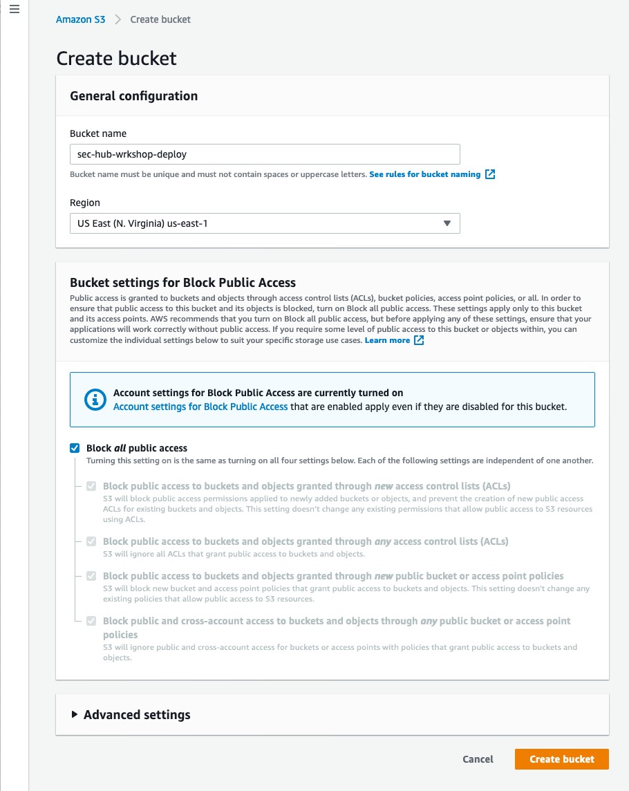
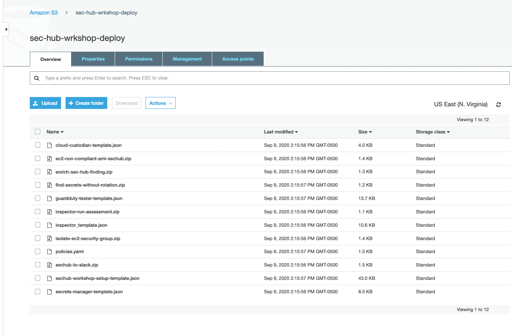
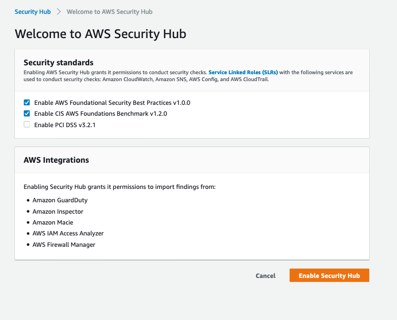
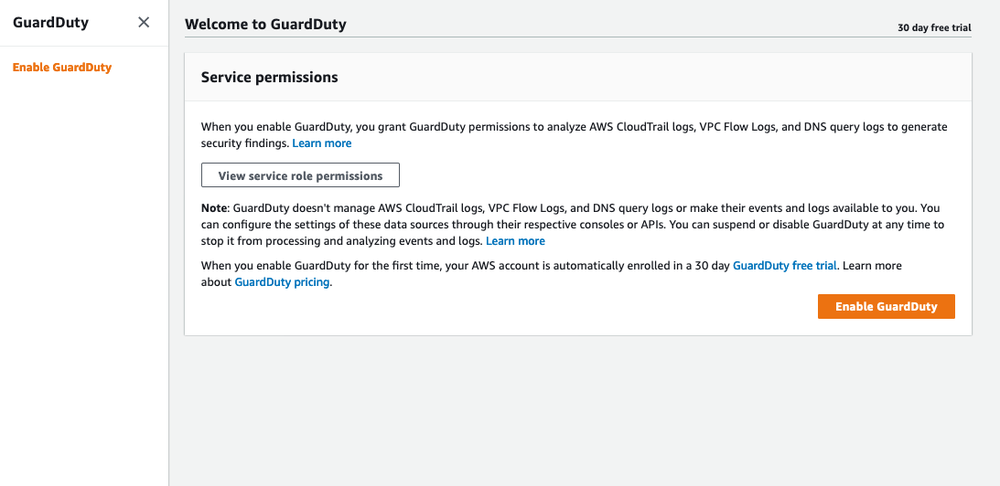
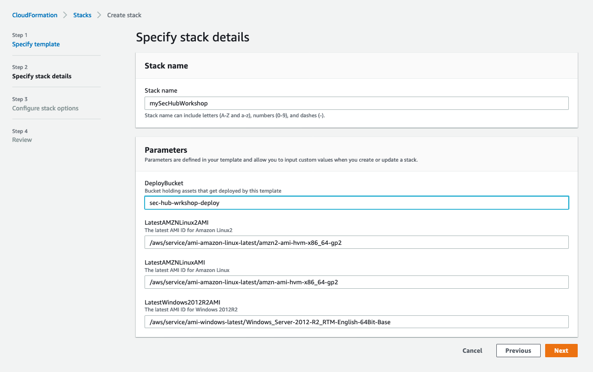

# Environment Setup

The procedures in this workshop use multiple Lambda functions, EC2 instances, and other AWS resources created via CloudFormation templates. In this module you will copy the important contents from the workshop GitHub repository and upload them into an S3 bucket in the AWS account you are using to perform the workshop.

**Agenda**
 
1. Download the workshop assets from GitHub - 5 min
2. Create S3 bucket and store workshop assets – 5 min
3. Enable Security Hub and enable GuardDuty - 5 min
4. Deploy workshop CloudFormation stack  - 10 min


## Download the workshop assets from GitHub

1. Navigate to https://github.com/aws-samples/aws-security-hub-workshop/blob/master/deploy/aws-security-hub-workshop-deploy.zip

2. Click **Download** to download the **aws-security-hub-workshop-deploy.zip** file to your local computer in a location that you can easily find.

3. Unzip the file on your local computer.  This will unzip the files to a directory named **deploy**.  

## Create S3 bucket and store workshop assets

1. Navigate to **S3 Console** and click **Create bucket**. 

2. Provide your own **bucket name** and do not adjust the default settings blocking public access.  

!!! info "S3 Bucket name needs to be unique.  You might have to add some additional numbers to the end of your desired name to make it unique."

3. **Record** the bucket name for later use.

4. Click **Create bucket**. 



5. Click your **bucket name** to navigate into your bucket.

6. From your local computer, upload the **contents** of the unzipped **/deploy/** directory into the root of your newly created bucket. 



!!! info "Do not proceed unless you have five(5) .zip files and five(5) .json files."

## Enable Security Hub and enable GuardDuty

1. From the **AWS Console** click **Services** in the top left corner

2. Type **Security Hub** in the services search bar.

3. Select **Security Hub** from the list.


4. Click **Go to Security Hub** on the right side of the page.

5. Leave AWS Foundational and CIS AWS Foundations **checked**.



6. Click **Enable Security Hub** on the Welcome to AWS Security Hub page.

7. Click **Services** in the top left corner.

8. Type **GuardDuty** in the search bar.

9. Click **Get started** in the center of the page.

10. Click **Enable GuardDuty** on the Welcome to GuardDuty page.




## Deploy workshop CloudFormation stack

7. Navigate to **CloudFormation Console**. 

8. Click **Create stack**.

9. In the **Amazon S3 URL**, add the path to your setup template. Replace [YOUR-BUCKET-NAME] in the example below.

```
https://[YOUR-BUCKET-NAME].s3.amazonaws.com/sechub-workshop-setup-template.json

```

10. Click **Next** on Create stack page.

11. Provide your **Stack name**.

12. In the **Parameters** enter the name of the S3 deployment bucket you created.   Leave all other parameters with their default value.



12. Click **Next** on Specify stack details page.

13. Click **Next** on Configure stack options page.

14. Scroll to the bottom and **check** both acknowledgments. 


15. Click **Create Stack**. 

!!! info "Use the refresh button to see updates as this template will create five nested templates and should take 5-10 minutes to complete."

In this module you created an S3 bucket, transferred the workshop artifacts, and deployed the setup templates.  After you have successfully created the stack, you can proceed to the next module.