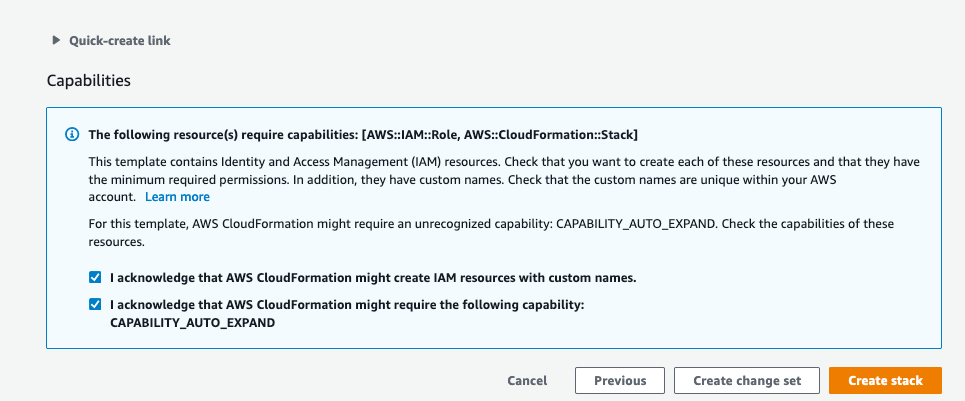
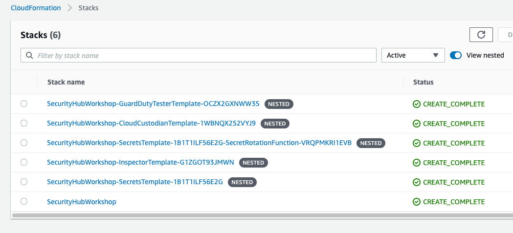

# Environment Setup
This workshop's procedures use multiple Lambda functions, EC2 instances, and other AWS resources created via CloudFormation templates. In this module, you will ensure that the right security services are configured and then deploy the template to create the overall workshop resources.

**Agenda**
 
1. Determine if have already enabled Security Hub, Config, GuardDuty, and IAM Access Analyzer - 5 min
2. Deploy workshop CloudFormation stack  - 10 min

## Determine if you have enabled Security Hub, Config, GuardDuty, and IAM Access Analyzer.
Config, Security Hub, GuardDuty, and IAM Access Analyzer must be enabled in the account and region you are conducting this workshop in.  The CloudFormation template that sets up the workshop has the option to enable all of this for you.  If you choose for that to happen, and these services are already enabled, the template will fail.

In order to correctly perform the next step, you must confirm the status of each of these services.  If you already know the status, such as a fresh account provided by AWS for this workshop, proceed to the [Deploy workshop CloudFormation stack](#deploy-workshop-cloudformation-stack) section.

1. In the **AWS Console** unified search box enter **Config** and select **Config** from the **Services** section..

2. If you see **Get started** in the center of the page, Config is **not** enabled.

    ??? info  "Optional Step: Click here for instructions on how to manually enable and set up AWS Config."

        1. From the <a href="https://console.aws.amazon.com/config/home" target="_blank">AWS Config dashboard</a>, click **Get Started**

        2. Step 1: Settings - Leave all of the default settings. Click **Next**. This will record all resources supported in this region and create a bucket to log data. It will also create an AWS Config service-linked role granting AWS Config the access recorded for it to function.

        3. Step 2: Rules - Under the field to filter by rule name, click **Select All**. This will highlight the AWS Config rules displayed. Then click **Next**. In your actual environment, you may want to pick and choose which rules are appropriate to enable for your workload.

        4. Step 3: Review - Click **Confirm**.

    ###

3. In the **AWS Console** unified search box enter **GuardDuty** and select **GuardDuty** from the **Services** section.

4. If you see **Get started** in the center of the page, GuardDuty is **not** enabled.

    ??? info  "Optional Step: Click here for instructions on how to manually enable and set up GuardDuty."

        1. From the <a href="https://console.aws.amazon.com/guardduty/home" target="_blank">GuardDuty page</a>, click **Get Started**.

        2. On the "Welcome to GuardDuty" screen, click **Enable GuardDuty**.

    ###

5. In the **AWS Console** unified search box enter **Security Hub** and select **Security Hub** from the **Services** section.

6. If you see  **Go to Security Hub** on the right side of the page, Security Hub is **not** enabled.

    ??? info  "Optional Step: Click here for instructions on how to manually enable and set up AWS Security Hub."

        1. From the <a href="https://console.aws.amazon.com/securityhub/home" target="_blank">AWS Security Hub page</a>, click **Go to Security Hub**

        2. On the "Welcome to AWS Security Hub" screen, check the boxes for all of the Security Standards. Then click **Enable Security Hub**.

    ###

7. In the **AWS Console** unified search box enter **IAM** and select **IAM** from the **Services** section.

8. In the lefthand navigation panel choose **Access Analyzer**.

9. If you see a page outlining how IAM Access Analzyer works, IAM Access Analyzer is **not** enabled. 

    ??? info  "Optional Step: Click here for instructions on how to manually enable and set up IAM Access Analyer."

        1. From the <a href="https://console.aws.amazon.com/access-analyzer/home" target="_blank">IAM Access Analzer page</a>, click **Create analyzer**

        2. In the "Create analyzer" screen leave the Name as it is.  For the "Zone of trust" choose **Current account**.  Click **Create analyzer** .

        ###

## Deploy workshop CloudFormation stack

To configure the workshop you will need to deploy the master workshop template.

!!! info "Before you deploy the CloudFormation template feel free to view it <a href="https://github.com/aws-samples/aws-security-hub-workshop/blob/master/templates/sechub-workshop-setup-template.json" target="_blank" rel="noopener noreferrer">here</a href>."

Region| Deploy
------|-----
US West 2 (Oregon) | |
US East 1 (Virgina) | 

1. Click the **Deploy to AWS** button above.  This will automatically take you to the console to run the template, click Next to get to the Specify Details page. 

2. On the **Specify Details** section enter the necessary parameters as shown below. 

    | Parameter | Value  | Parameter Details|
    |---|---|---|
    | Stack name | **SecurityHubWkshp**  ||
    | EnableGuardDuty | **Yes-Enable GuardDuty** or   **No-GuardDuty is already enabled**  ||
    | EnableSecurityHub| **Yes-Enable Security Hub** or   **No-Security Hub is already enabled**||
    |EnableConfig| **Yes-Enable Config** or   **No-Config is already enabled**||
    |EnableIAMAA| **Yes-Enable IAM AA** or   **No-IAM AA is already enabled**||
    |CreatePublicResourcePolicies| **Yes-Create public policies** or   **No-Dont create public policies**|Creates an SQS queue with a policy allowing public access for posting messages to the queue.|

    **Leave all other parameters with their default values**

!!! info "If set to Yes, the CreatePubicResourcePolicies parameter will result in the template creating AWS resources that have resource policies that grant public access to the resource.  Creation of these resources enables IAM Access Analyzer to detect and report findings for these resources.  Deployment of these resources is optional as some environments, outside of AWS event environments, may detect and report on this resource as a company policy violation.  See the parameter details for information on which public resources the parameter will create."

3. Once you have entered your parameters click **Next**.

4. Click **Next** again. \(leave everything on this page at the default\)

5. Finally, scroll down and check the boxes to acknowledge that the template will create IAM resources and that the template will need CAPABILITY_AUTO_EXPAND.  Then click **Create**.

This will bring you back to the CloudFormation console. You can refresh the page to see the stack starting to create. This template will create five nested templates and should take 5-10 minutes to complete.  Before moving on, make sure the stack is in a **CREATE_COMPLETE** status as shown below.

!!! info "Once the full stack creation is done you should see findings created in Security Hub over the next 30 minutes of this workshop."

After you have successfully created the stack, you can proceed to the next module.