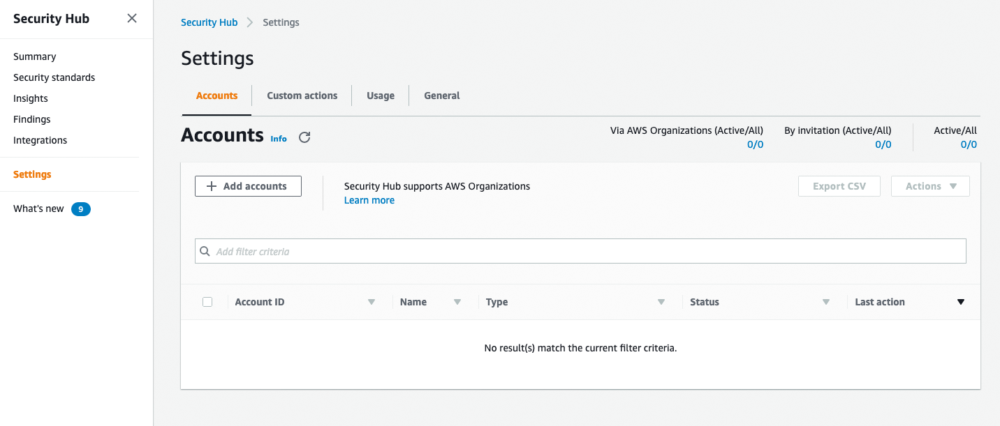
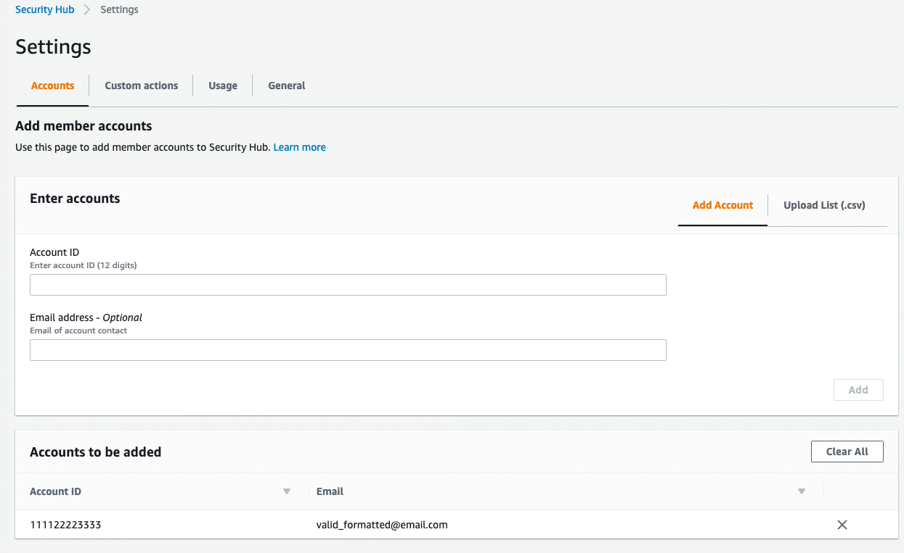
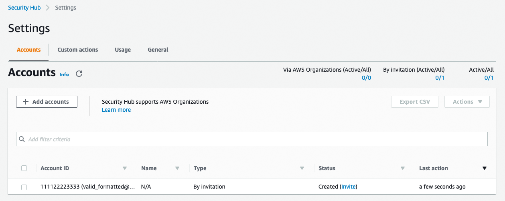

# Module 1: Security Hub Walkthrough 

In this section of the Security Hub Workshop, you will follow a guided demonstration of the features of Security Hub.  You can use this demonstration to learn about Security Hub's capabilities.   

**Agenda** 20 minutes
 
1. Summary Page
2. Multi-Account Hierarchy
3. Integrations
4. Insights
5. Explore Security Standards

## Security Hub Summary Page

The Security Hub Summary page gives you an overview of security and compliance status of your AWS account(s). 

!!! info "Some of the data in your account may differ from the screenshots and some maybe blank."

1. From the **AWS Console** click **Services** in the top left corner

2. Type **Security Hub** in the services search bar.

3. Select **Security Hub** from the list.

    

4. Click **Summary** on the left hand navigation.

    

    !!! info "Security Hub automatically enables subscriptions to GuardDuty and Inspector.  Also collected, but not used in this workshop are findings from Macie, IAM Access Analyzer, and Firewall Manager."

5. Observe the Passed and Failed status of the **CIS AWS Foundations**.  Even though you just enabled it a few minutes ago, partial results of the 43 total checks have been collected.

    

6. Scroll down to the graphs under **Insights** (Your graphs maybe different).  Move your mouse over **New findings over time by provider** and observe the 3 sources of findings that Security Hub is already collecting.  (There will be more throughout this workshop)

    

7. Scroll down further under **Insights**.  Move your mouse over **Accounts with the most findings (by resource type)** and observe the sorted list of AWS resources that have findings to investigated.

    

## Multi Account Hierarchy  
An AWS Security Hub administrator account can view data from and manage configuration for its member accounts. The Security Hub administrator-member relationship is established differently based on whether the accounts belong to an organization in AWS Organizations. 

If you are integrated with Organizations, the organization management account designates the Security Hub administrator account, which becomes the administrator account.  The Security Hub administrator account automatically has access to all of the accounts in the organization. The Security Hub administrator account determines which accounts in the organization to enable as member accounts. These member accounts cannot disassociate themselves from the Security Hub administrator account.

If you are not integrated with Organizations, member accounts accept an invitation from a administrator account. A Security Hub administrator account for an organization can also invite member accounts that are not part of the organization.  Accounts that are added by invitation can disassociate themselves from their administrator account. 

In this section we will add a member account to your Workshop Security Hub Account.  These instructions use sample information and will not actually setup the Multi-Account Hierarchy. 

!!! info "(Optional)You can invite another AWS account you are the owner of to enable AWS Security Hub and become associated with your Workshop AWS account.  In the steps below, instead of false data use information for another you AWS account you own, you can accept the invitation, and you can enable Security Hub."

1. Click **Settings** on the left hand navigation.

    

2. Click **+ Add accounts** above the empty account table.

3. Enter **111122223333** (Four 1's, 2's, & 3's) in the **Account ID** field.

4. Enter a valid formatted **email address**. (for this example it doesn't have to be a real email.)

5. Click **Add**

    

6. Click **Next**

7. Click **Invite** in the Status field of the member accounts table.

8. Click **Invite**.

    !!! info "At this point a user with the appropriate permissions in the destination AWS account could accept this invite from the master account"

    

## Integrations
In this section, we will walk through the Security Hub side of enabling a partner integration. Security Hub provides the ability to integrate security findings from AWS services and third-party products.  For third-party products Security Hub gives you the ability to selectively enable the integrations and provides a link to the configuration instructions related to the third-party product.   
 
Security Hub detects and consolidates only those security findings from the supported AWS and partner product integrations that are generated after Security Hub is enabled in your AWS accounts. It doesn't retroactively detect and consolidate security findings that were generated before you enabled Security Hub. 

1. Click on **Integrations** from the left-hand navigation pane. 

    

2. Scroll through the list of available integrations.  Return to the top and **search** for **Cloud Custodian**.   

    

3. Click **Accept Findings**.  Review the permissions required for the integration. 

    

4. Click **Accept findings**. 

    !!! info "This will put in place a service policy allowing the partner solution to send finding information into this account.   For the purposes of this workshop a Cloud Custodian instance is already set up to automatically send findings to the integration you just enabled.  To use other partner integrations in your account, you would still need to complete the **Configure** step in the partner solution so findings that are created by the partner solution are sent to Security Hub. "

    

## Findings
Security Hub imports findings AWS security services, third-party product integrations that you enable, and custom integrations you build. Security Hub consumes these findings using a standard findings format called AWS Security Finding Format (ASFF), which eliminates the need for time-consuming data conversion efforts. Security Hub then correlates the findings across integrated products to prioritize the most important ones. For more information about the findings format, see <a href="https://docs.aws.amazon.com/securityhub/latest/userguide/securityhub-findings-format.html" target="_blank">AWS Security Finding Format</a>.  

1. Click on **Findings** from the left-hand navigation pane. 

    

2. Click in the Search bar and select **Severity label** and enter **MEDIUM** (it must be all capitalized). 

    

3. Click **Apply**.   

4. Select a **Title** of any finding to see more information.

    

5. Click the arrow next to **Resources** on bottom right.

    

6. Click the [+] to the right of this findings **Resource Type** (e.g. AWSEc2Instance). this will add it as a filter to the search. 

    

## Insights  
A Security Hub Insight is a collection of related findings defined by an aggregation statement and optional filters. An insight identifies a security area that requires attention and intervention. Security Hub offers several managed (default) insights that you can't modify or delete. You can also create custom insights to track security issues unique to your AWS environment and usage.  

1. Click on **Insights** from the left-hand navigation pane. 

    

2. Filter for insight **severity**.

    

3. Click on **24. Severity by counts of findings**.

    

    !!! info "The **Group By: Resource Id** in the filter is what makes this an Insight"

4. Select a **Severity Label** (e.g. Critical) to see the underlying finding(s).

## Security Standards 
Security Hub currently supports multiple security standards:

- Payment Card Industry Data Security Standard (PCI DSS) v3.2.1:
>The Payment Card Industry Data Security Standard (PCI DSS) standard in Security Hub consists of a set of AWS security best practices controls. Each control applies to a specific AWS resource, and relates to one or more PCI DSS version 3.2.1 requirements. A PCI DSS requirement can be related to multiple controls. The details page for each PCI DSS control lists the specific PCI DSS requirements that are related to that control.The PCI DSS Compliance Standard in Security Hub is designed to help you with your ongoing PCI DSS security activities. The controls cannot verify whether your systems are compliant with the PCI DSS standard. They can neither replace internal efforts nor guarantee that you will pass a PCI DSS assessment.
- AWS Foundational Security Best Practices v1.0.0:
> The AWS Foundational Security Best Practices standard is a set of controls that detect when your deployed accounts and resources deviate from security best practices. The controls include best practices from across multiple AWS services. Each control belongs to one of the following categories, which are based on the functions described in the NIST Cybersecurity Framework. 

- Center for Internet Security (CIS) AWS Foundations v1.2.0:
> AWS Security Hub has satisfied the requirements of CIS Security Software Certification and is hereby awarded CIS Security Software Certification for the following CIS Benchmarks: CIS Benchmark for CIS Amazon Web Services Foundations Benchmark, v1.2.0, Level 1 and Level 2

To run the CIS AWS Foundations standard's compliance checks on your environment's resources, Security Hub either runs through the exact audit steps prescribed for the checks in <a href="https://www.cisecurity.org/benchmark/amazon_web_services/" target="_blank"> Securing Amazon Web Services</a> or uses specific AWS Config managed rules. Therefore, for the CIS AWS Foundations standard to be functional in Security Hub, when you enable it in a particular account, you must also enable AWS Config in that account. Security Hub doesn't manage AWS Config for you. For this workshop Config has already been enabled for you.

!!! info "The first round of compliance checks will be done within 2 hours of enabling security hub and then runs every 12 hours."

1. Click on **Security standards**.

    

    !!! info "Note the Security score should have changed from when you first enabled the CIS standard.  If your score shows 0% or -, disable and then re-enable the security standards."

2. Click **View Results** for CIS AWS Foundations Benchmark v1.2.0.

    

3. Filter on **4.1**.

    

4. Click **4.1 Ensure no security groups allow ingress from 0.0.0.0/0**. 

    

5. Scroll down and you will notice there are some **FAILED** and some **PASSED** 

6. Click the **Remediation instructions link**, to open guidance in a new tab.

    !!! info "AWS Security Hub Security Standards provide remediation instructions for each check."

Now that you have explored Security Hub's capabilities, you can proceed to the next module.

