# Module 1: Security Hub Walkthrough 

In this section of the Security Hub Workshop, you will follow a guided demonstration of the features of Security Hub.  You can use this demonstration to learn about Security Hub's capabilities.   

**Agenda** 20 minutes
 
1. Summary Page
2. Integrations
3. Insights
4. Findings
5. Explore Security Standards
6. Understand Usage Summary

## Security Hub Summary Page

The Security Hub Summary page gives you an overview of security and compliance status of your AWS account(s). 

!!! info "Some of the data in your account may differ from the screenshots and some maybe blank."

1. From the **AWS Console** click **Services** in the top left corner

2. Type **Security Hub** in the services search bar.

3. Select **Security Hub** from the list.

    

4. Click **Summary** on the left hand navigation.

    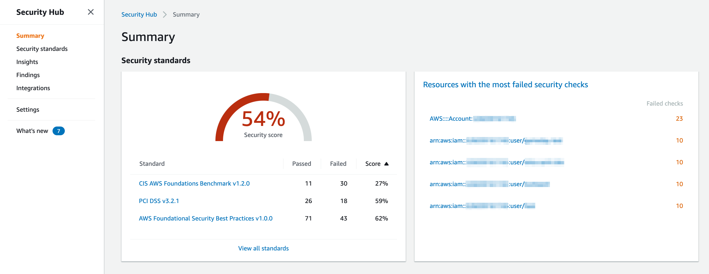

5. Observe the Passed and Failed status of the **CIS AWS Foundations**.  Even though you just enabled it a few minutes ago, partial results for this security standard have already been collected.
    

6. Scroll down to the graphs under **Insights** (Your graphs may be different).  Move your mouse over **New findings over time by provider** and observe the multiple sources of findings that Security Hub is already collecting.  (There will be more throughout this workshop)

    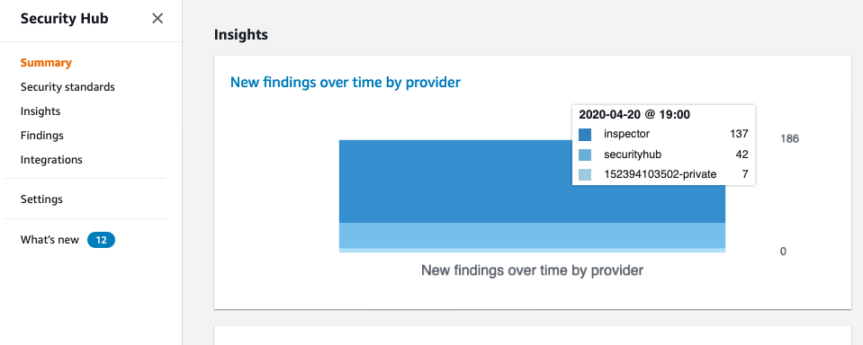

7. Scroll down further under **Insights**.  Move your mouse over **Accounts with the most findings (by resource type)** and observe the sorted list of AWS resources that have findings to investigated.

    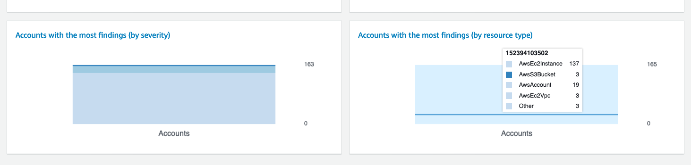

## Integrations
In this section, we will walk through the Security Hub side of enabling a partner integration. Security Hub provides the ability to integrate security findings from AWS services and third-party products.  For AWS services Security Hub automatically enables the integration, and you can optionally disable each integration.  For third-party products Security Hub gives you the ability to selectively enable the integrations and provides a link to the configuration instructions related to the third-party product.   
 
Security Hub detects and consolidates only those security findings from the supported AWS and partner product integrations that are generated after Security Hub is enabled in your AWS accounts. It doesn't retroactively detect and consolidate security findings that were generated before you enabled Security Hub. 

1. Click on **Integrations** from the left-hand navigation pane. 

    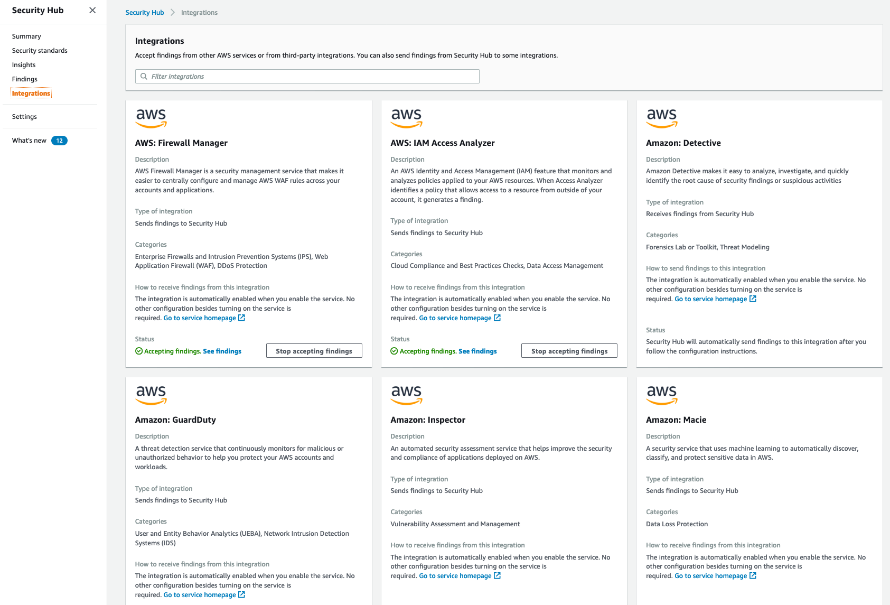

2. Scroll through the list of available integrations.  Note that integrations for AWS services are automatically enabled.  Return to the top and **search** for **Cloud Custodian**.   

    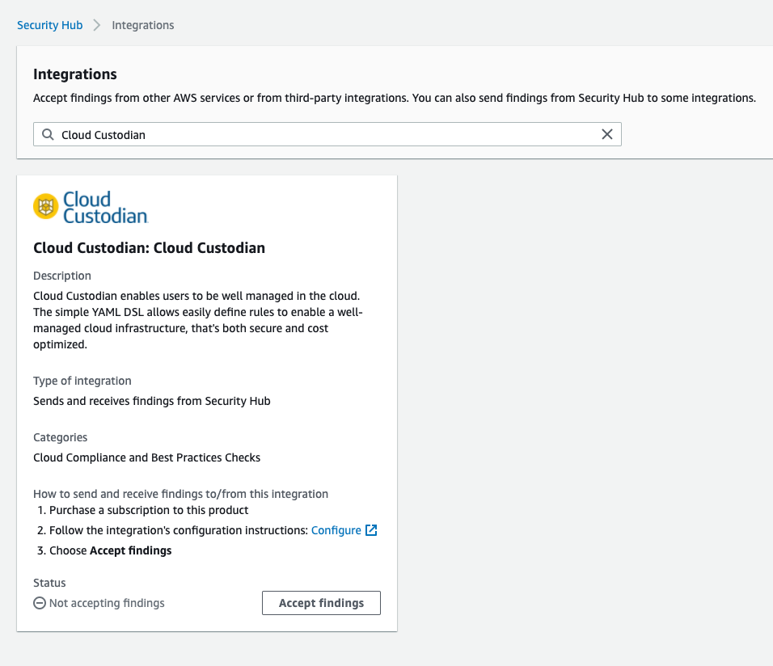

3. Click **Accept Findings**.  Review the permissions required for the integration. 

    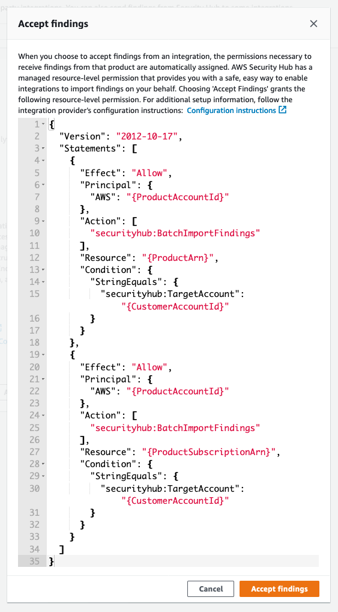

4. Click **Accept findings**. 

    !!! info "This will put in place a service policy allowing the partner solution to send finding information into this account.   For the purposes of this workshop a Cloud Custodian instance is already set up to automatically send findings to the integration you just enabled.  To use other partner integrations in your account, you would still need to complete the Configure step in the partner solution so findings that are created by the partner solution are sent to Security Hub. "

    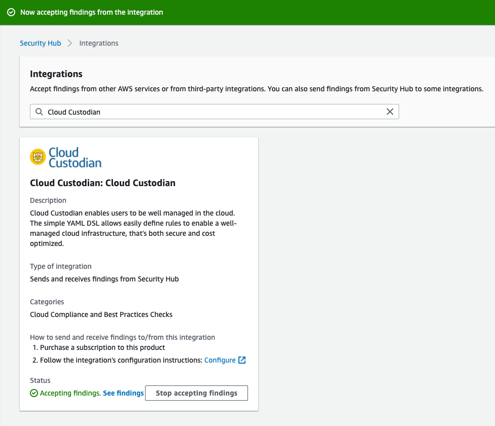

## Findings
Security Hub imports findings AWS security services, third-party product integrations that you enable, and custom integrations you build. Security Hub consumes these findings using a standard findings format called AWS Security Finding Format (ASFF), which eliminates the need for time-consuming data conversion efforts. Security Hub then correlates the findings across integrated products to prioritize the most important ones. For more information about the findings format, see <a href="https://docs.aws.amazon.com/securityhub/latest/userguide/securityhub-findings-format.html" target="_blank">AWS Security Finding Format</a>.  

1. Click on **Findings** from the left-hand navigation pane. 

    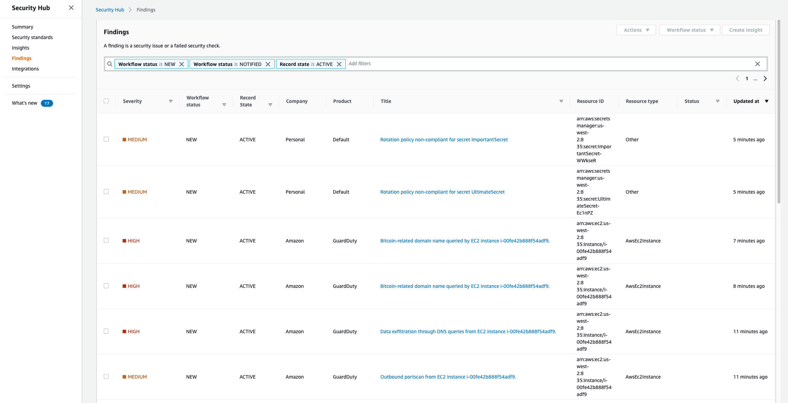

2. In its default view the Findings tab can have a lot of information for you to consume.  To narrow the overall list of findings down enter some search criteria.  Click in the Search bar and select a filter field of **Severity label**, a filter match type of **is** and a search value **MEDIUM** (Search value must be all capitalized). 

    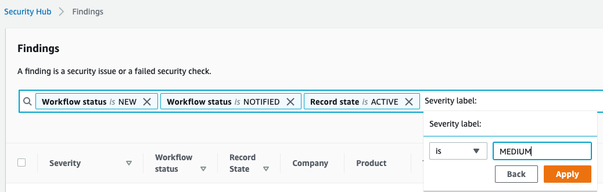

3. Click **Apply**.   

4. Select a **Title** of any finding to see more information in the finding details pane.

    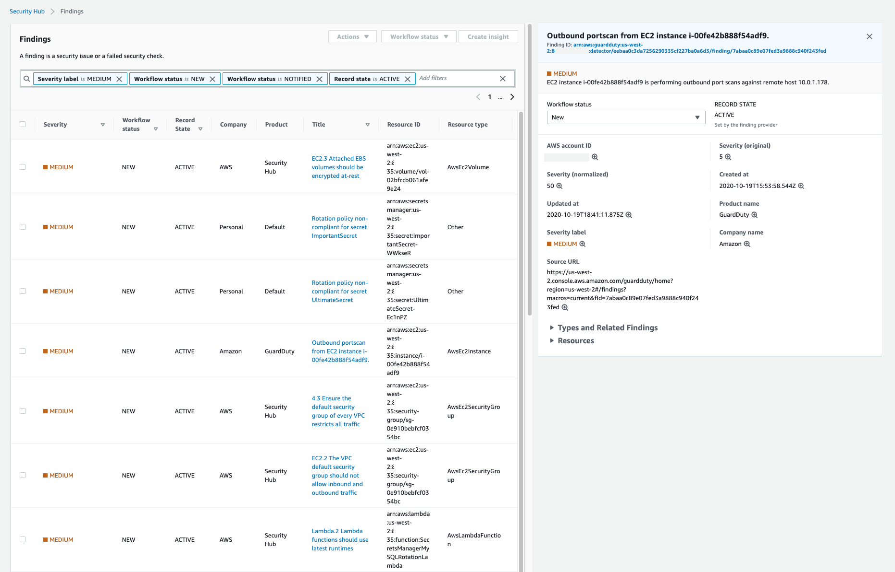

5. In the finding details pane click the arrow next to **Resources** on bottom right.

    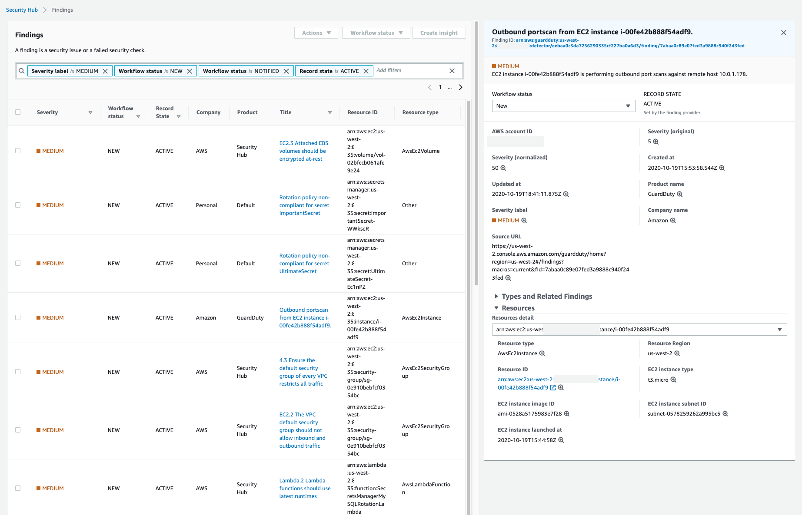

6. Click the [+] to the right of this findings **Resource Type** (e.g. AWSEc2Instance). This will add the resource as a filter to the search. 

    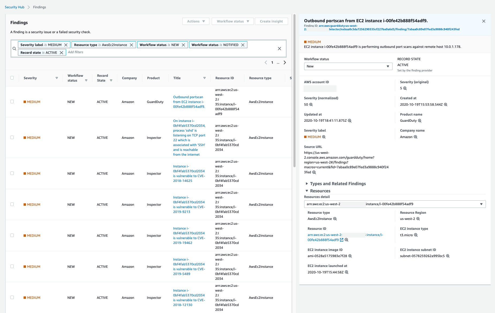

7. In the finding details pane choose the finding ID at the top of the pane to display the complete JSON for the finding.  The finding JSON can be downloaded to a file if ever needed for further investingation.

## Insights  
A Security Hub Insight is a collection of related findings defined by an aggregation statement and optional filters. An insight identifies a security area that requires attention and intervention. Security Hub offers several managed (default) insights that you can't modify or delete. You can also create custom insights to track security issues unique to your AWS environment and usage.  

1. Click on **Insights** from the left-hand navigation pane. 

    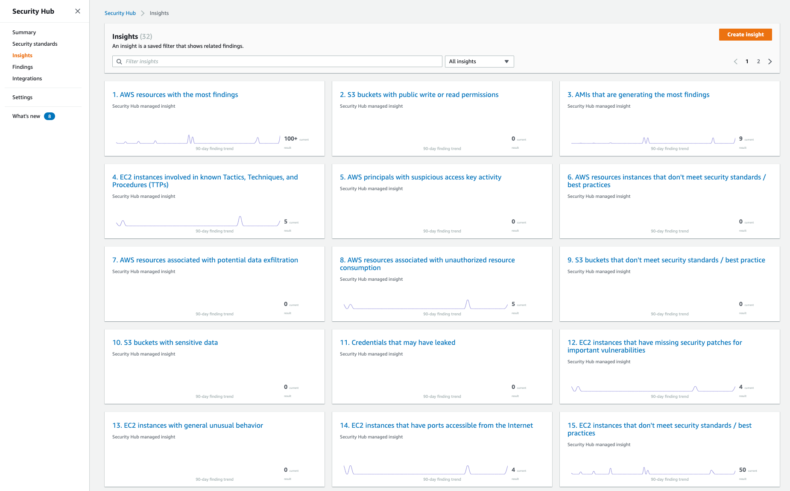

2. Filter for insight **severity**.

    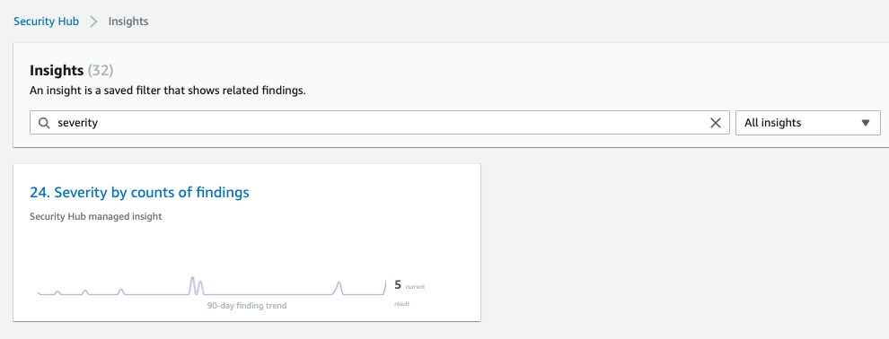

3. Click on **24. Severity by counts of findings**.

    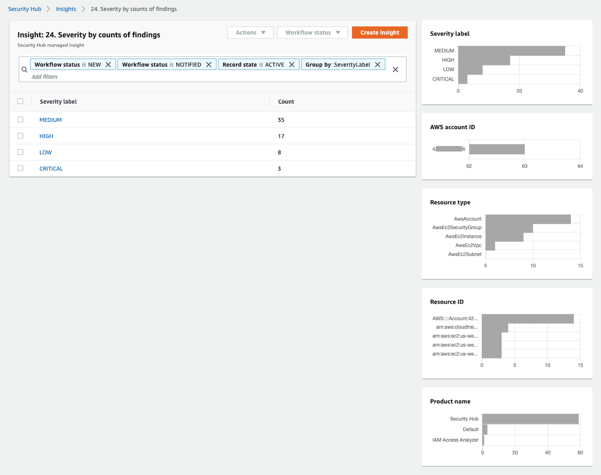

    !!! info "The **Group By: Resource Id** in the filter is what makes this an Insight"

4. Select a **Severity Label** (e.g. Critical) to see the underlying finding(s).

## Security Standards 
Security Hub currently supports multiple security standards:

- Center for Internet Security (CIS) AWS Foundations v1.2.0:
> AWS Security Hub has satisfied the requirements of CIS Security Software Certification and is hereby awarded CIS Security Software Certification for the following CIS Benchmarks: CIS Benchmark for CIS Amazon Web Services Foundations Benchmark, v1.2.0, Level 1 and Level 2

- AWS Foundational Security Best Practices v1.0.0:
> The AWS Foundational Security Best Practices standard is a set of controls that detect when your deployed accounts and resources deviate from security best practices. The controls include best practices from across multiple AWS services. Each control belongs to one of the following categories, which are based on the functions described in the NIST Cybersecurity Framework.

- Payment Card Industry Data Security Standard (PCI DSS) v3.2.1:
>The Payment Card Industry Data Security Standard (PCI DSS) standard in Security Hub consists of a set of AWS security best practices controls. Each control applies to a specific AWS resource, and relates to one or more PCI DSS version 3.2.1 requirements. A PCI DSS requirement can be related to multiple controls. The details page for each PCI DSS control lists the specific PCI DSS requirements that are related to that control.The PCI DSS Compliance Standard in Security Hub is designed to help you with your ongoing PCI DSS security activities. The controls cannot verify whether your systems are compliant with the PCI DSS standard. They can neither replace internal efforts nor guarantee that you will pass a PCI DSS assessment.

More information about each of these security standards can be found at: <a href="https://docs.aws.amazon.com/securityhub/latest/userguide/standards-available.html" target="_blank"> Available security standards in AWS Security Hub</a>

To run the CIS AWS Foundations standard's compliance checks on your environment's resources, Security Hub either runs through the exact audit steps prescribed for the checks in <a href="https://www.cisecurity.org/benchmark/amazon_web_services/" target="_blank"> Securing Amazon Web Services</a> or uses specific AWS Config managed rules. To use the AWS Config managed rules AWS Config must be enabled in the account where you are using Security Hub. For this workshop Config has already been enabled for you. 

!!! info "The first round of compliance checks will be done within 2 hours of enabling Security Hub and then runs every 12 hours."

1. Click on **Security standards**.

    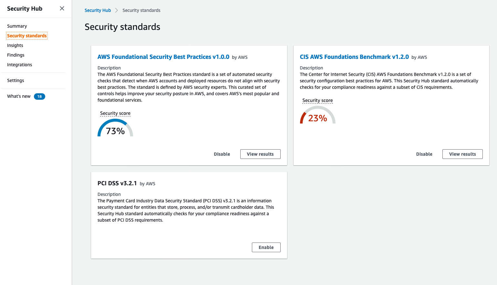

    !!! info "Note the Security score should have changed from when you first enabled the CIS standard.  If your score shows 0% or -, disable and then re-enable the security standards."

2. Click **View Results** for CIS AWS Foundations Benchmark v1.2.0.

    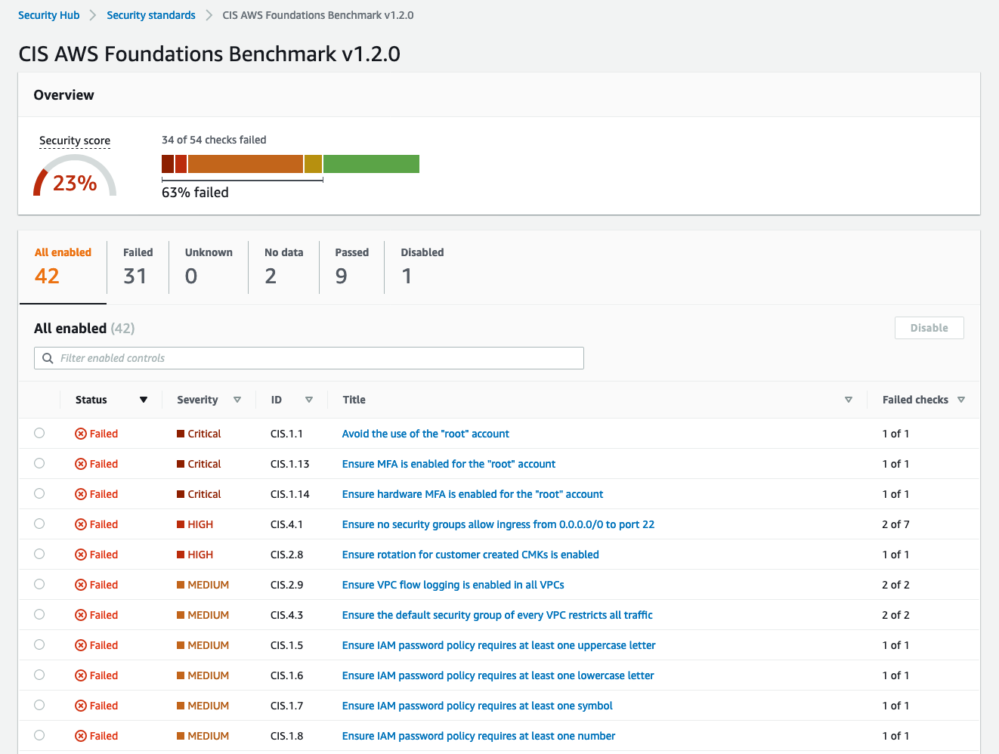

3. Filter on **4.1**.

    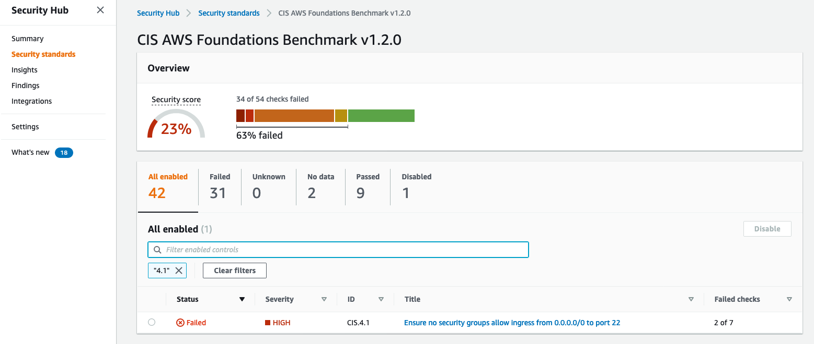

4. Click on the Title: **Ensure no security groups allow ingress from 0.0.0.0/0**.  This presents a view of all resources evaluated for this particular control and the current status of each resource as it relates to the control.  

    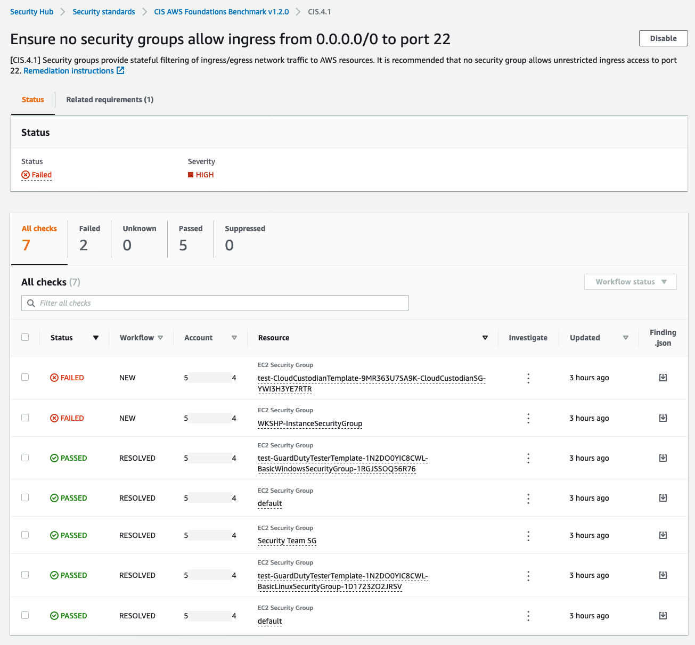

5. At the top of the page click the **Remediation instructions link**, to open guidance in a new tab.

    !!! info "AWS Security Hub Security Standards provide remediation instructions for each check."

6. Scroll down and you will notice there are some resources with a **FAILED** and status some with a **PASSED** status.  For one of the **FAILED** resources click on the three dots in the **Investigate** column.  This will display links that will take you to AWS Config to view the configuration timeline for this resource or the overall config rule that performed the evaluation on this resource.  Feel free to click the links to explore more about the resource and the config rule.   
    
    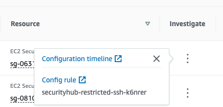

## Usage Summary

Security Hub provides usage info for your AWS account, helping you to understand what your monthly billing estimate will be and which components of Security Hub are contributing to your bill.  Security Hub offers a 30 day free trial for each account.  During the free trial Security Hub provides an estimate of what the spend would be so you can assess your spend beyond the free trial.  

1. Click **Settings** on the left hand navigation.

2. Click the **Usage** tab in the **Settings** screen.

3. On the left hand side of the screen your usage for the billing period is displayed.  Usage is broken down by findings ingested and by security checks that have been run.  At the bottom of the usage summary is the total estimated cost for the billing period.  On the right hand side is the current Security Hub pricing so that you can see how the usage in your account contributed to the estimated cost.  

    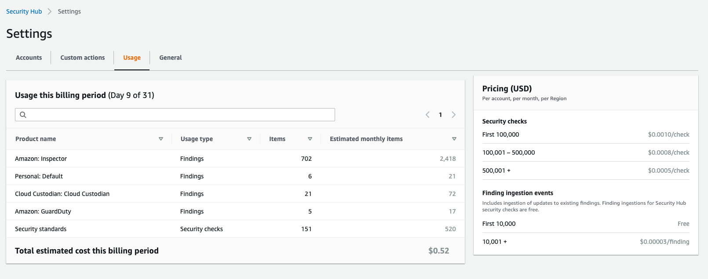

Now that you have explored Security Hub's capabilities, you can proceed to the next module.

