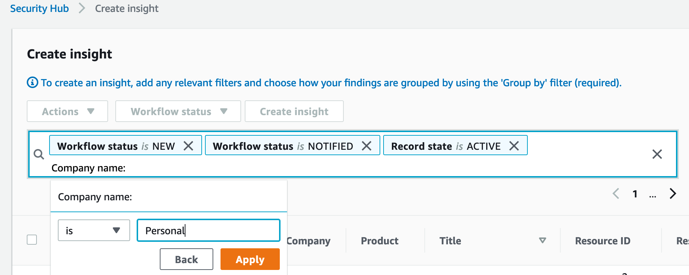

# Module 2: Custom Insights and Custom Findings

A key feature of Security Hub is the ability to create security findings that are above and beyond the native integrations that Security Hub has with AWS services or 3rd party providers.  This custom findings feature gives customers the flexibility to build their security checks against their AWS environment and import them into Security Hub.

In the environment for this workshop, multiple sources that are sending custom findings into Security Hub:
* The open-source Cloud Custodian project running on an EC2 instance.
* A Config Rule checking for non-compliant AMIs.
* A Lambda function looking for non-compliant secrets.

This module will guide you on how to either view or fully integrate these findings sources into Security Hub.

**Agenda**
 
1. Create Custom Findings with AWS Config  - 15 min
2. Create Custom Insight for Custom Findings - 10 min

## Create Custom Findings with AWS Config 

In this section we will cover how you can create your own findings in Security Hub.  The foundation for this section will be using AWS Config Rules to identify compliance violations and then posting those violations into Security Hub. 
 
This is a representation of the architecture you will be implementing: 

For this part of the workshop a Config rule has already been defined.  The specific Config rule being used is **approved-amis-by-id**.  This rule looks for EC2 instances backed by AMIs that are not in the rule's list of approved AMIs.  Any EC2 instances that are not using an AMI that is in the approved list will be reported by the rule as noncompliant.

### Create EventBridge Rule
This section creates the rule which will catch messages sent from Config rules about noncompliant resources and route them to a target.

1. Navigate to the Amazon EventBridge Console.

2. Click on the **Create rule** on the right side.

3. In the Create rule page give your rule a **name** and a **description** that represents the rule's purpose.

!!! info "All Config Rule output is sent as events to the AWS default event bus.  The define pattern section allows you to identify filters to take a specific action when matched events appear."

4. Under Define pattern, select **Event pattern**. 

5. Select **Pre-defined pattern by service**.

6. In the drop down for **Service Provider**, select **AWS**.

7. In the drop down for **Service Name**, select or type and select **Config**.

8.	Choose **Config Rules Compliance Change** for the **Event Type**. 

9.	Chose the **Specific rule name(s)** radio button and enter **approved-amis-by-id** in the text box.

10. Under Select targets, ensure **Lambda function** is populated in the top drop down and then select **ec2-non-compliant-ami-sechub** lambda function. 

!!! info "**ec2-non-compliant-ami-sechub** is a custom Lambda function created during the setup of this workshop.  Feel free to look at the function to learn more about how it integrates with Security Hub."

11. Click **Create**.

### Create a rule to track approved AMIs 
This section will run the config rule to generate information on noncompliant resources and send them to Security Hub.

1. Navigate to the **AWS Config** dashboard

2. From the Config Dashboard click **Rules** on the left menu.

!!! Make sure to not choose Rules from the Aggregated view menu.  This requires Config Aggregator and this feature is not used in this workshop.

2. In the Rules page there will be one rule named **approved-amis-by-id**.  Click on the rule name to go to the detail page for that rule.  

In the rule detail screen you will see the rule configured with a list of approved AMIs.  There will also be one resource showing as noncompliant. Now that the EventBridge is in place you want to see the noncompliant instances show in Security Hub as a finding.

3. Click on the **Delete results** button.  In the confirmation popup click **Delete**.

4.  Click on the refresh button in the **Choose resources in scope** section.  The noncompliant resource section should now be empty.  

5. Click the **Re-evaluate** button.  You will get a message that the Config rule is in use and that you need to refresh the page.  At this point you can either refresh the entire page in your browser or use the refresh button in the **Choose resources in scope** section of the page.

An instance should now be showing as noncompliant in the **Choose resources in scope** section.  This re-run of the config rule will trigger the EventBridge rule that is looking for noncompliant resources, resulting in the finding showing in Security Hub.  

!!!Clearing results and re-evaluating the config rule is being done to help force sending findings into Security Hub for this workshop.  Under normal circumstances you will not need manually run the config rule in order to get findings to show in Security Hub.  Once you have the Config and EventBridge rules configured, new noncompliant resources will automatically flow into Security Hub as a config rule finds noncompliant resources.  

### View the noncompliant AMI finding in Security Hub 

1.	Navigate to the **Security Hub** dashboard. 

2.	Click on the **Findings** option in the left-hand navigate menu. 

3.	You should see a rule towards the top of the findings list with a **Company** of **Personal** and a **Title** about an unapproved AMI for an instance.  This is the result of your compliance rule and its integration with EventBridge.  Click on the **Title** link for the finding to view more details for your finding.

You now have setup in place that helps demonstrate how you can send custom findings into Security Hub using AWS data sources and EventBridge rules.

!!!In your environment the Lambda function **find-secrets-without-rotation** checks for secrets that have a rotation time that is beyond the max days parameter on the function.  When secrets are found with a rotation time beyond what is defined in the function a finding is created in Security Hub.  Take some time to explore the Lambda function to see how you can directly send custom findings into Security Hub.  

## Create Custom Insights for Custom Findings

This section will walk you through how to create a custom insight to give you more visibility around the sources that are sending findings into Security Hub for custom findings.

When a custom finding is sent into Security Hub it will have a company of **Personal** and a product of **Default**.  Unlike integrations from AWS services and approved 3rd parties, you cannot use the Company and/or Product fields to determine the source of your finding for custom findings.

However, Security Hub provides the ability to create insights that filter on more attributes than you can see from the initial findings console.  You can filter on additional attributes that are passed in as part of a finding that enable you to get more granular in how you filter findings.

For this lab the custom findings have been built to utilize the Generator ID field in the AWS Security Finding Format (ASFF) to help in identifying sources of findings.  

1. Navigate to the **Security Hub** dashboard.

2. Choose **Insights** from the left hand navigation.

3. Click **Create insight**.

4. Click in the filter field at the top to add additional filters.

5. Choose a filter field of **Company name**.  Choose a filter match type of **is** and a value of **Personal**.

6. Choose a filter field of **Product name**.  Choose a filter match type of **is** and a value of **Default**.

7. Choose a Grouping of **Group by:**.  In the list of options choose **Generator ID**.  

8. Click on **Create insight** to save your custom insight.

9. Give your insight a name that is meaningful to you and click **Create insight**.

10. **Refresh** your browser to reload the screen with Graphs.

You now have a custom insight that allows you to get more visibility around custom findings that are coming into Security Hub, allowing you more visibility into what your security findings are related to, what the source of the findings are, and where you should prioritize your remediation efforts.   
For the findings in this custom insight you can click on the resource ID links to drill into the specific findings related to those resources. 
 
Feel free to play with the grouping for your insight to see other attributes that you can group by and the different views of data it creates.  

