# Module 3: Remediation and Response CIS Benchmark and Custom Action 

After Security Hub has detected configuration that needs attention, the next step is take action and resolve the finding.  In the first half of this module, you will connect a Security Hub custom action to a provided Lambda function.  This function isolates an EC2 instance from the VPC network when invoked.  In the second half, you will deploy the auto remediation and response actions for the CIS AWS Foundations standard. 


**Agenda**
 
1. Create a Security Hub Custom Action to Isolate an EC2 Instance – 10 min
2. Deploy remediation playbooks for CIS Benchmarks - 15 min

## Create a Security Hub Custom Action to Isolate an EC2 Instance 

This guide will show you how to create a custom action in Security Hub and then tie that to an EventBridge rule which calls a Lambda function to change the security group on an EC2 instance that is part of a Security Hub finding. 

### Create a Custom Action in Security Hub 

1.	Navigate to the **Security Hub** console. 

2.	In the left-hand navigation pane choose **Settings**. 

3.	Choose the **Custom actions** tab. 

4.	Click the **Create custom action** button. 

5.	Enter an Action Name, Action Description, and an Action ID that are representative of an action that would isolate an EC2 instance. 

    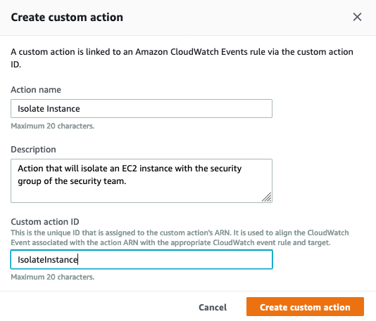

6. Click **Create custom action**.

7. Copy the Custom action ARN that was generated for your custom finding.

    !!! info "You will need the Custom ARN in the next steps."

    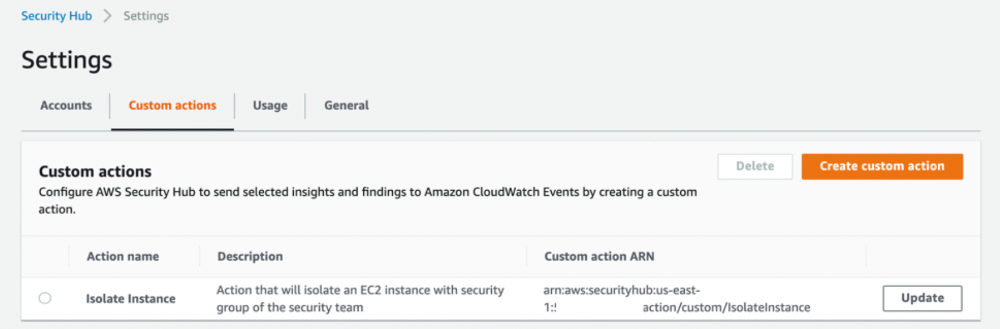

### Create Amazon EventBridge Rule to capture the Custom Action 


 Events from AWS services are delivered to CloudWatch Events and Amazon EventBridge in near real time. You can write simple rules to indicate which events you're interested in and what automated actions to take when an event matches a rule. The actions that can be automatically triggered include: an AWS Lambda function, Amazon EC2 Run Command, Relaying the event to Amazon Kinesis Data Streams, an AWS Step Functions state machine, an Amazon SNS topic, a ECS task, and others.

In this section, you will define an EventBridge rule that will match events (Findings) coming from Security Hub which were forwarded by the custom action you defined above. 

1. Navigate to the **Amazon EventBridge** Console.

2. Click on the **Create rule** on the right side.

    

3. In the Create rule page give your rule a **name** and a **description** that represents the rule's purpose.

    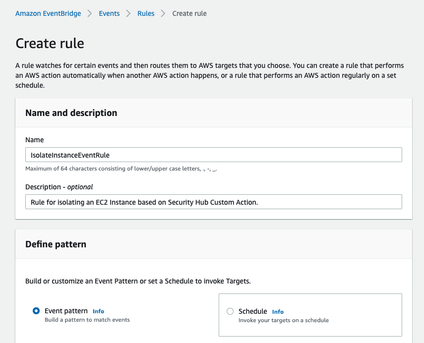

    !!! info "All Security Hub findings are sent as events to the AWS default event bus.  The define pattern section allows you to identify filters to take a specific action when matched events appear."

4. Under Define pattern, select **Event pattern**. 

5. Select **Pre-defined pattern by service**.

6. In the drop down for **Service Provider**, select **AWS**.

7. In the drop down for **Service Name**, select or type and select **Security Hub**. 

8. In the drop down for **Event type** choose **Security Hub Finding – Custom Action**.

    

9.	In the **Event Pattern** window click the **Edit** button. 

10.	Add in the resources line as shown below, making sure to paste in the ARN of **your Custom Event**.  Click **Save**. 

    !!! info "Note the comma after the bracket before the resources definition."

    Copy and paste in the custom event pattern below.  Use the ARN you recorded for your Security Hub Custom Action 
    	
    <pre>
    ```
    { 
    "source": [ 
        "aws.securityhub" 
        ], 
        "detail-type": [ 
            "Security Hub Findings - Custom Action" 
        ], 
        "resources": [ 
            "arn:aws:securityhub:[YOUR-REGION]:[YOUR-ACCOUNT-ID]:action/custom/IsolateInstance" 
        ] 
    } 
    ```

    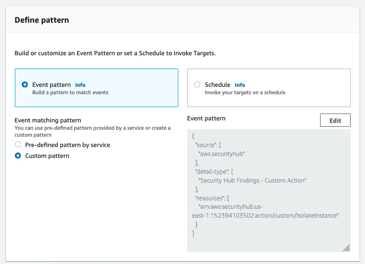

11. Under Select targets, ensure **Lambda function** is populated in the top drop down and then select **isolate-ec2-security-group** Lambda function. 

    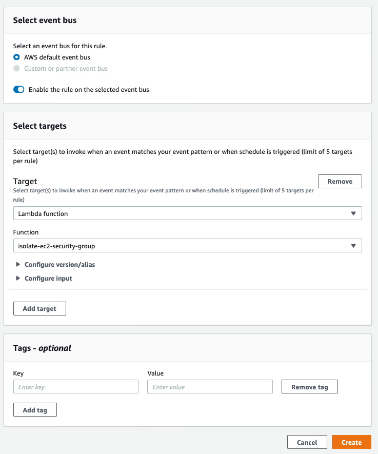

    !!! info "**isolate-ec2-security-groups** is a custom Lambda function created during the setup of this workshop."

12. Click **Create**.

### Isolate the security group on an EC2 Instance 

Now you will test the response action starting from a Security Finding for an EC2 instance. 

1. Navigate to the **Security Hub** Dashboard.

2. In the left-hand navigation pane choose **Findings**.

3. Add a filter for **Resource Type** and enter **AwsEc2Instance** (case sensitive).

4. Click the title of any finding in this filtered list where the target is the type **AwsEc2Instance**.

5. Expand **Resources** section of the finding.

6. Click the blue link for this EC2 instance, under the heading **Resource ID**. 

    !!! info "This will open a new tab showing on the EC2 console showing only this affected EC2 instance."

7. Click the instance record, and then click the **Security** tab and record the name of the current **security group**.

    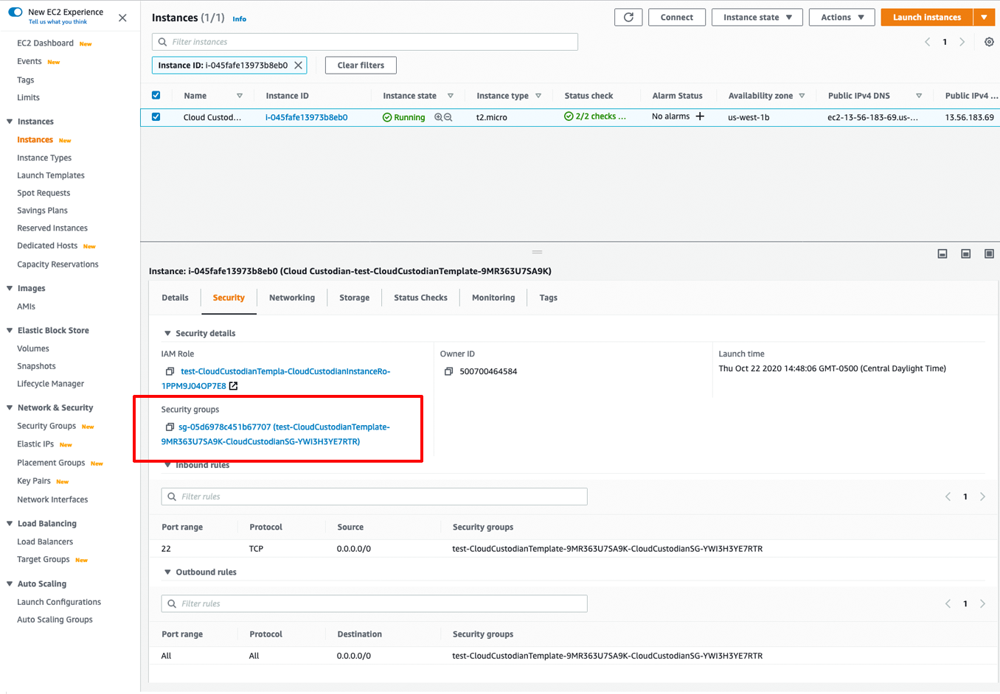

8.	Go back to your **Security Hub tab** in your browser and click in the check box in the far left of this same finding.

9. In the **Actions** drop down choose the name of your custom action to Isolate EC2 Instances. 

    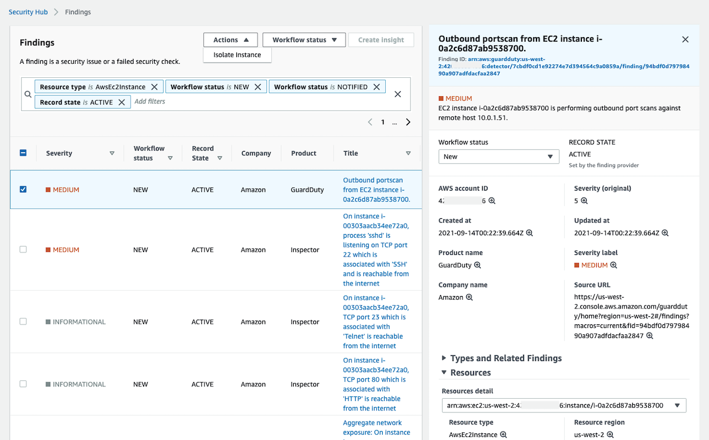

10. Go back to the **EC2 browser tab**.  Refresh the tab.  Verify that the security group on the instance has been changed to the security team security group. 


    !!! question "Review the isolate-ec2-security-group Lambda function.  What changes would you make for your own custom actions?"

## Deploy remediation playbooks for CIS Benchmarks

By creating Security Hub custom actions mapped to specific finding type and by developing a corresponding Lambda function for that custom action, you can achieve targeted, automated remediation for these findings. This allows you to decide if you want to invoke a remediation action on a specific finding. You can also use these Lambda functions as the target of fully automated remediation actions that do not require any human review.

You can read more in <a href = 'https://aws.amazon.com/blogs/security/automated-response-and-remediation-with-aws-security-hub/'  target="_blank">this blog</a> to select specific CIS benchmark remediations or customize response actions.


### Deploy remediation playbooks via CloudFormation

!!! info "Before you deploy the CloudFormation template feel free to view it <a href="https://github.com/aws-samples/aws-security-hub-response-and-remediation/blob/master/SecurityHub_CISPlaybooks_CloudFormation.yaml" target="_blank" rel="noopener noreferrer">here</a href>."

Region| Deploy
------|-----
US West 2 (Oregon) | <a href="https://console.aws.amazon.com/cloudformation/home?region=us-west-2#/stacks/create/review?stackName=SecurityHub-CISPlaybooks&templateURL=https://sa-security-specialist-workshops-us-west-2.s3-us-west-2.amazonaws.com/security-hub-workshop/templates/SecurityHub_CISPlaybooks_CloudFormation.yaml" target="_blank"></a>|
US East 1 (Virgina) | <a href="https://console.aws.amazon.com/cloudformation/home?region=us-east-1#/stacks/create/review?stackName=SecurityHub-CISPlaybooks&templateURL=https://sa-security-specialist-workshops-us-east-1.s3.amazonaws.com/security-hub-workshop/templates/SecurityHub_CISPlaybooks_CloudFormation.yaml" target="_blank"></a>

!!! info "If you are running this workshop in an AWS provided environment and it is not in one of the above regions you can still deploy the remediation template, via CloudFormation, in the region you are performing the workshop in.  For Step 1, click either of the Deploy to AWS buttons and when that takes you to the CloudFormation console you can change your region in the top right corner of the AWS console to your desired region.  Once you have created the stack with this template you can pick up this section at step 2 below."


1. Click the **Deploy to AWS** button above, for the region you are performing the workshop in.  This will automatically take you to the console to submit the template.

2. Scroll to the bottom of the **Quick create stack** screen and check the box for **I acknowledge that AWS CloudFormation might create IAM resources.**

3. Click **Create stack**.

    !!! info "Please wait a moment for the creation to complete or progress to start, then proceed to Step 4."

4. Navigate to the **Resources** tab of this CloudFormation stack and observe the resources created for each rule.

    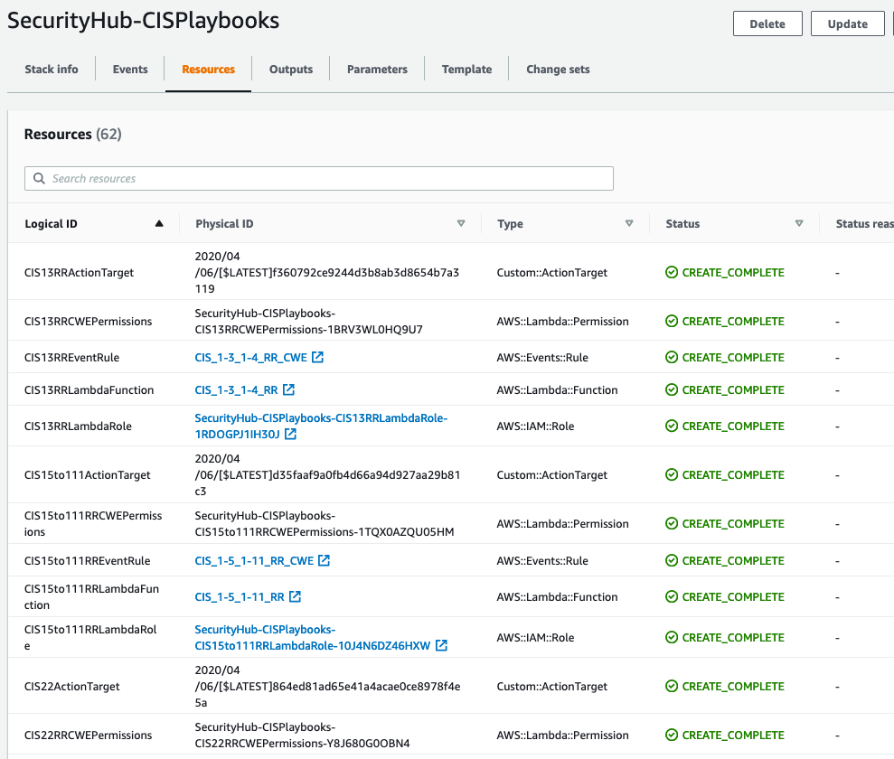

5. Type "**CIS28**" in Search resources bar. 

    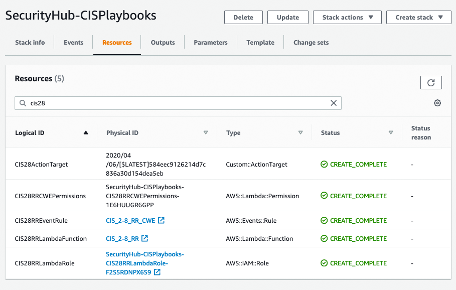

    !!! info "Note the resources created for this remediation action are a Security Hub custom action to initiate the remediation, a Lambda function with the code to execute the response, an IAM role and permission for Lambda to assume and take the needed actions, and an EventBridge Rule that connects the custom action to the Lambda function."

6. Navigate to the **Security Hub** dashboard. 

7. In the left-hand navigation pane choose **Security Standards**.

8. Under CIS AWS Foundations Benchmark v1.2.0 click **View results**.

    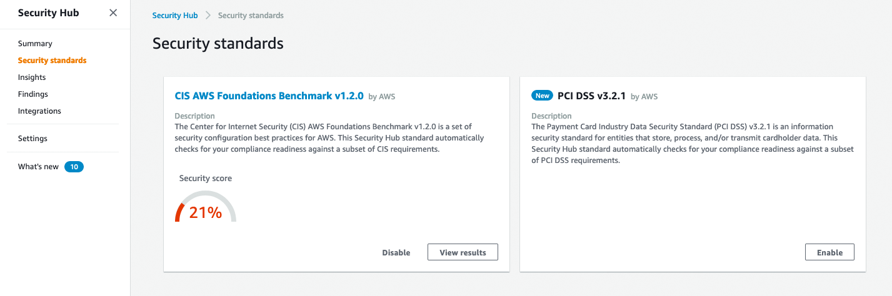

9. Type "**2.8**" in the Filter controls bar.

    !!! info "AWS KMS enables customers to rotate the backing key, which is key material stored in AWS KMS and is tied to the key ID of the CMK. It's the backing key that is used to perform cryptographic operations such as encryption and decryption. Automated key rotation currently retains all previous backing keys so that decryption of encrypted data can take place transparently."

    !!! info "We recommend that you enable CMK key rotation. Rotating encryption keys helps reduce the potential impact of a compromised key because data encrypted with a new key can't be accessed with a previous key that might have been exposed."

10. Click the title for "CIS 2.8 Ensure rotation for customer created CMKs is enabled"

    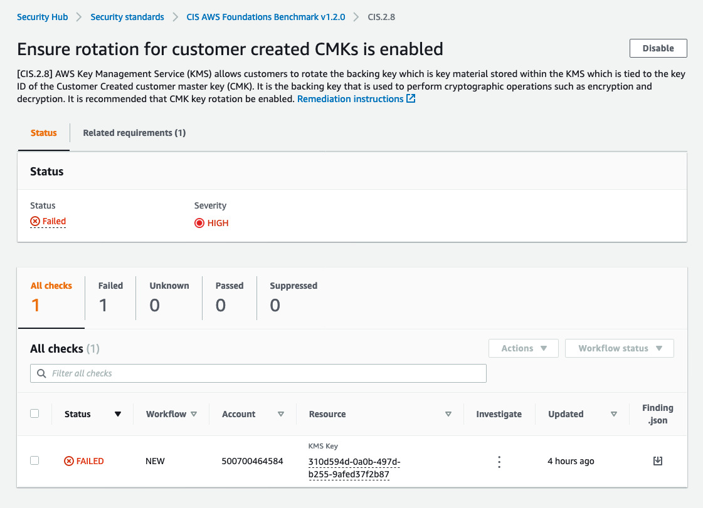

11. Click the **check box** to select the finding.

12. Click the **Actions** drop down on the right side and select **CIS 2.8 RR**.

    !!! info "This triggers the remediation Lambda function associated with resolving CIS 2.8.  Notice the list of available actions you have for CIS created from the template deployment."

    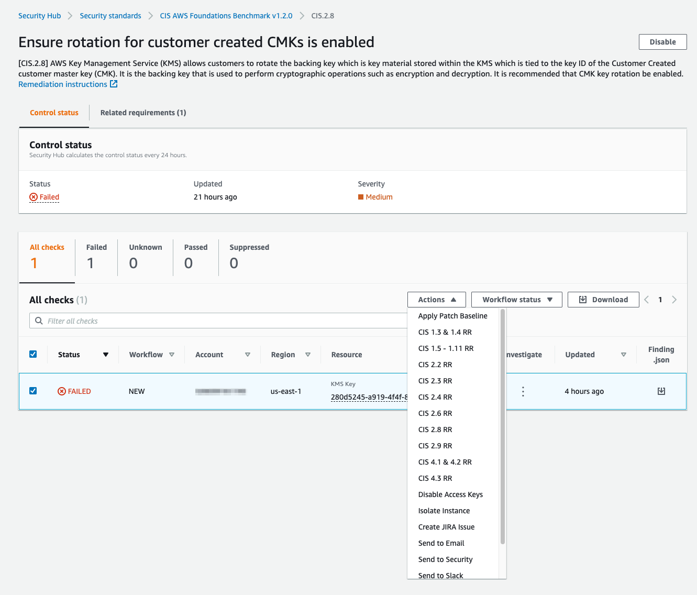

    !!! info "Choosing this action sends a copy of the finding(s) to EventBridge.  The findings then trigger a matching rule in EventBridge which then initiates a Lambda.  The Lambda function enables key rotation on the KMS keys that are covered by the key(s) that were selected when the Security Hub custom action was chosen."

    !!! info "After the green bar has confirmed the execution of the custom check, we need to manually initiate a re-evaluation in Config in order to resolve the finding in Security Hub."

13. Click the three vertical dots to expand associated links to Config.

14. Click the link for **Config Rule**.

    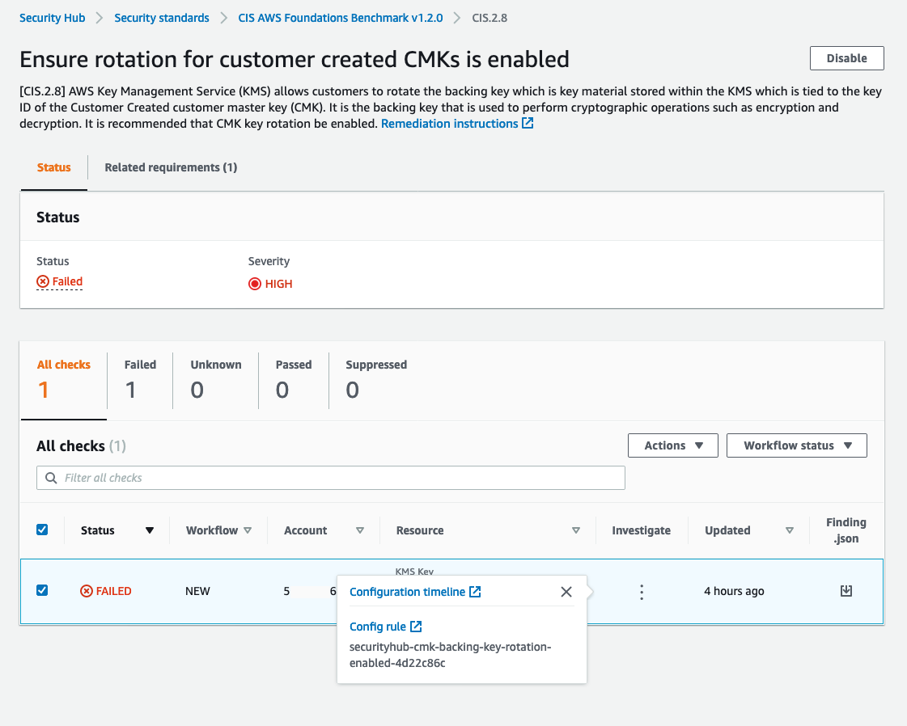


15. Click **Re-evaluate** at the top of the page.

16. Click the browser tab to return to the filtered findings for CIS 2.8 and refresh your browser. The findings should now have a status of PASSED.

    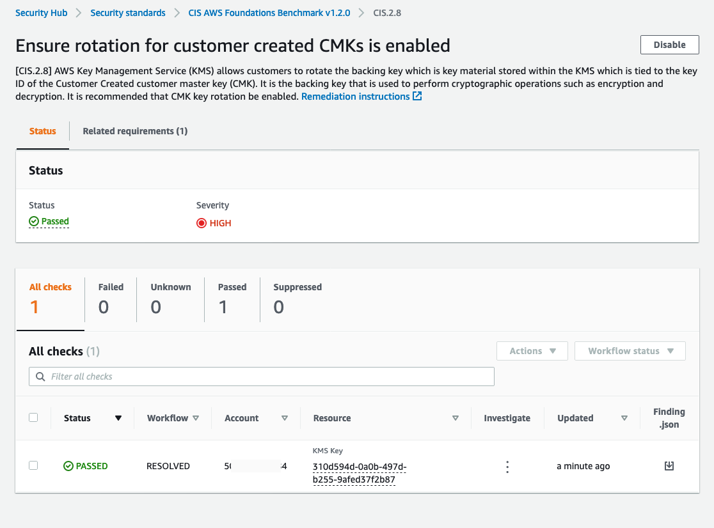

In this module you associated a custom action in Security Hub with a custom Lambda function for remediation and deployed a series of pre-build remediations for CIS Account Foundational checks.  After you have successfully tested your response to CIS 2.8, you can proceed to the next module.
