# Module 4: Finding Enrichment and Integration

In this module you will explore two patterns to respond to findings via a notification workflow.  In the first section, you will setup a custom action to post Security Hub findings into a Slack channel.  In the second section, you will use a custom action to look up and add EC2 tags to findings as a custom note.

**Agenda**
 
1. Custom Action to Send Findings to Slack – 20 min
2. Enable Custom Action to add Tag data as Notes to Security Hub Findings  - 10 min


## Custom Action to Send Findings to Slack

In this section we will setup a custom action that will send the details of a Security Hub Finding to a lambda function that will format the message and then post into our demo Slack security channel.  A more automated workflow could also be created where all, or a filtered set of, Security Hub findings could be sent to slack.  

Once the setup is complete, the finding data will flow from left to right in the below diagram. However, the setup steps themselves must be completed in the numbered order to accommodate required dependencies. 

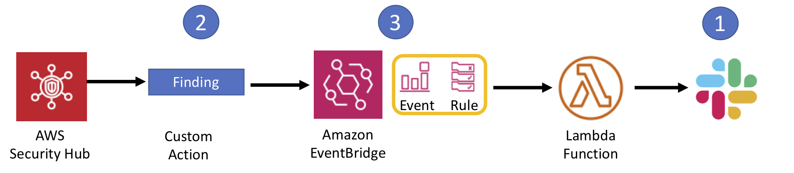

### Setup Slack 

1. Use the following link to create a new Slack Workspace for yourself:  
https://get.slack.help/hc/en-us/articles/206845317-Create-a-Slack-workspace 
 
!!! info "After completing these steps, you should have a slack workspace with a name you used to create it. Keep this information handy." 

### Create a channel to receive security hub alerts 

When you created the slack workspace, you would have typed in something under “What is your Company doing?”. This sets up a default channel on Slack. You can choose to use this to receive Security Hub findings or create a new channel.

If you want to create a new channel click on the + next to 'Channels' and create a new channel.

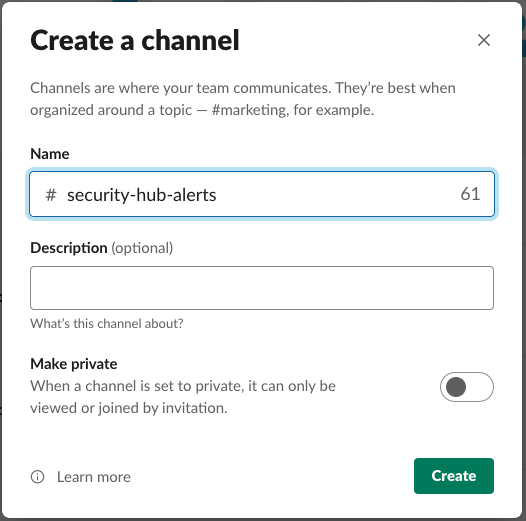


### Create an Incoming Webhook in Slack API 

1. Go to your Slack API(https://api.slack.com).  

2. Click **Start Building**.  
 
3. Click on **Create an App** button. 

4.  Fill in the following details for your app:  
    - **App Name**: security-hub-to-slack 
    - **Development Slack Workspace**: Choose the Slack workspace that will receive the Security Hub findings ( this is the one you created)  

    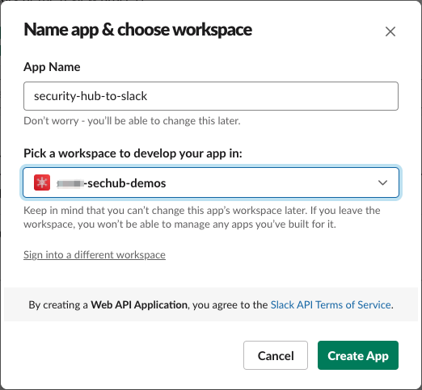

5. Click the **Create App** Button.

6.  Select **Incoming Webhooks**. 

7.  At the **Activate Incoming Webhooks** screen, move the slider from OFF to ON. 

8. Scroll down and choose **Add New Webhook to Workspace**. 
 
9. In the screen asking where your app should post choose the channel that you created in an earlier step.

    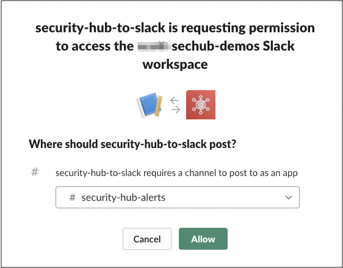

10. On the next screen, scroll down to the Webhook URL section and save the URL as you will need it later to complete your setup.


### Create Custom Action in Security Hub

To send information on findings that are in Security Hub to Slack a custom action in Security Hub needs to be defined. The following steps outline how to set up a custom action: 

1. Go to Security Hub Console: https://console.aws.amazon.com/securityhub/. 

2. Click on **Settings**. 

    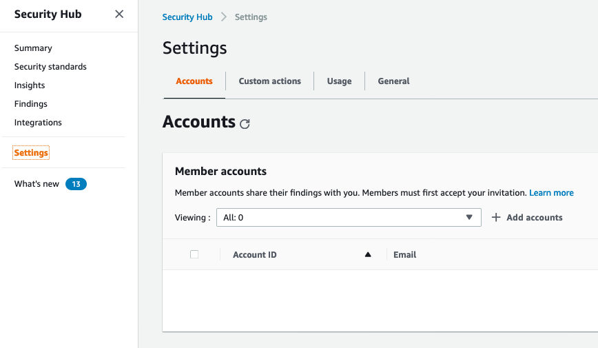

3. Click **Custom Actions**.

    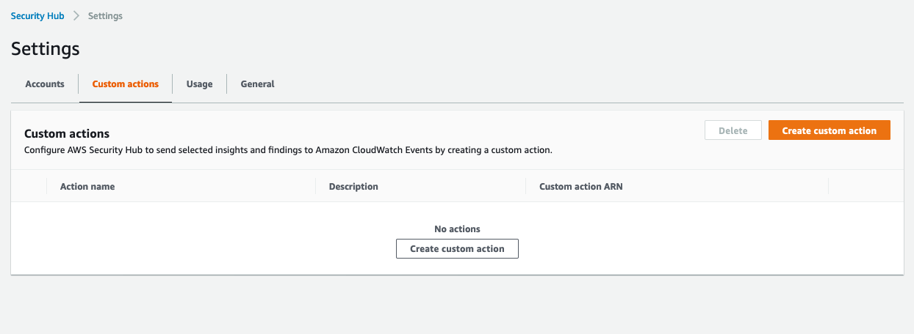

4. Select Create Custom Action. Fill in: 
    * **Action Name** as ‘Send to Slack’, 
    * **Description** as ‘Custom action to send security findings to Slack.’ 
    * **Custom Action ID** as shslaction 

5. Click **Create custom action**.

  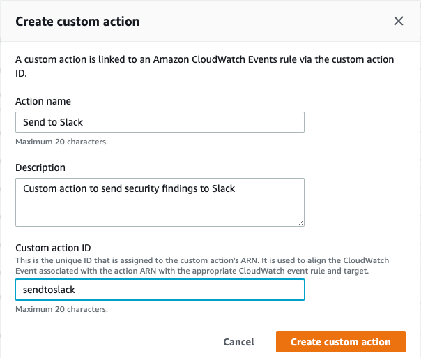


### Create a EventBridge Rule for Security Hub Custom Actions to Lambda

Taking action on a finding in Security Hub results in the information for the finding and the ARN of the custom action being sent to EventBridge. To successfully process this action, a EventBridge rule  needs to be defined so the action information can be sent to Slack. 

1. Navigate to the **Amazon EventBridge** Console.

2. Click on the **Create rule** on the right side.

    

3. In the Create rule page give your rule a **name** and a **description** that represents the rule's purpose.

    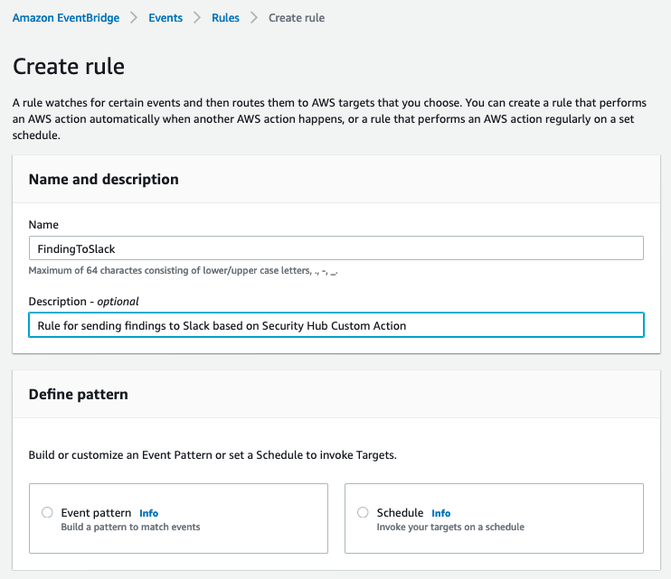

    !!! info "All Security Hub findings are sent as events to the AWS default event bus.  The define pattern section allows you to identify filters to take a specific action when matched events appear."

4. Under Define pattern, select **Event pattern**. 

5. Select **Pre-defined pattern by service**.

6. In the drop down for **Service Provider**, select **AWS**.

7. In the drop down for **Service Name**, select or type and select **Security Hub**. 

8. In the drop down for **Event type** choose **Security Hub Finding – Custom Action**.

    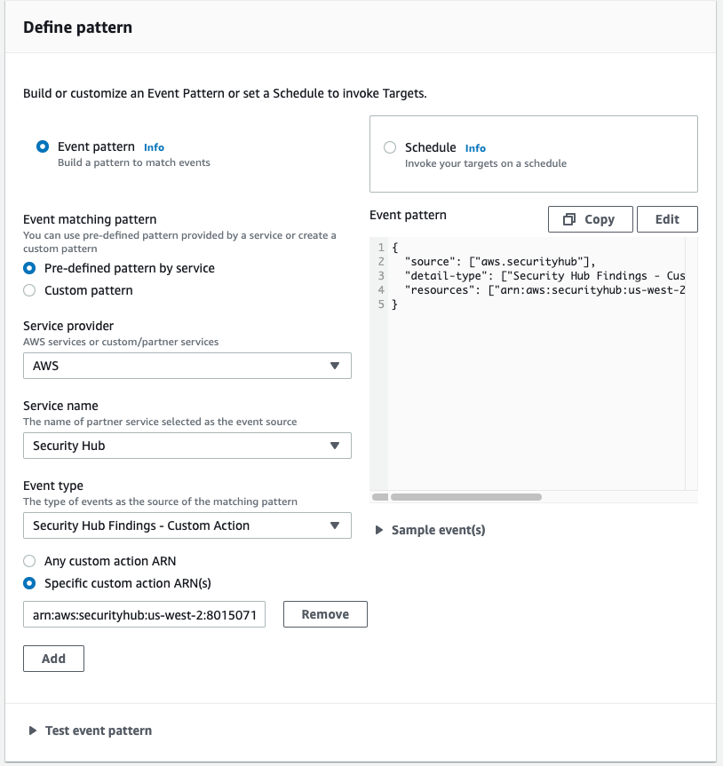

9.	In the **Event Pattern** window click the **Edit** button. 

10.	Add in the resources line as shown below, making sure to copy in the ARN of **your Custom Event**.  Click **Save**. 

    !!! info "Note the comma after the bracket before the resources definition."

    Copy and paste in the custom event pattern below.  Use the ARN you recorded for your Security Hub Custom Action 
    
    <pre>
    ```
    { 
    "source": [ 
        "aws.securityhub" 
      ], 
      "detail-type": [ 
        "Security Hub Findings - Custom Action" 
      ], 
      "resources": [ 
         "arn:aws:securityhub:us-east-1:[YOUR-ACCOUNT-ID]:action/custom/shslaction" 
      ] 
    } 
    ```

    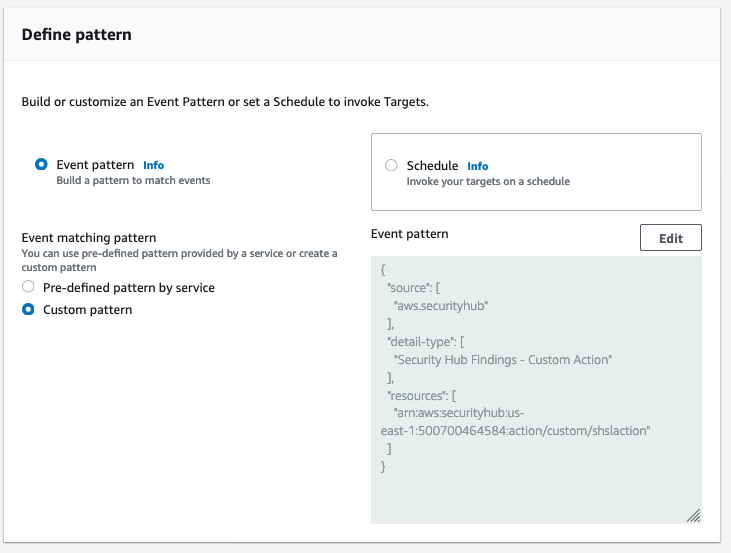

11. Under Select targets, select **Lambda function**.

12. Then select the **sechub-to-slack** lambda function. 

    

13. Click **Create**.

### Update the Lambda Function to send messages to Slack 
The last step in this setup is to update the environment variables of your lambda function so that notifications can be sent to the correct Slack workspace.

1. Navigate to the **Lambda** console.

2. In the list of functions choose the **sechub-to-slack** function.

3. Click the **Configuration** tab.

4. Scroll down to environment variables and click **Edit**   Fill in:
    * **slackChannel:** the value from the Slack channel you created earlier in this workshop.
    * **webHookUrl:** URL of the webhook for the Slack setup you created earlier in this workshop.

    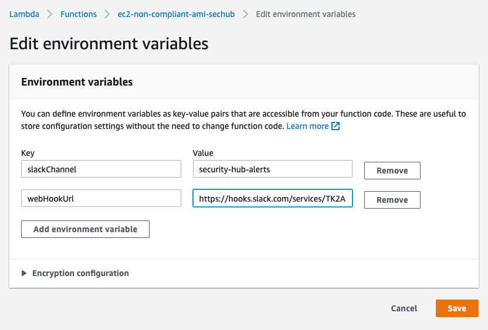

5. Click **Save**.

### Testing the Integration between Security Hub and Slack  

At this point, you are now able to start using a Security Hub custom action to send Findings to Slack. 

1.	Go to Security Hub Console: https://console.aws.amazon.com/securityhub 

2.	Click on **Findings** option, and the Findings screen will show a list of all your open Security Hub findings. 

3.	Choose any one of the findings and then select the **Send to Slack** custom action from the **Actions** drop down. A success message appears indicating the event was sent to CloudWatch events. 

    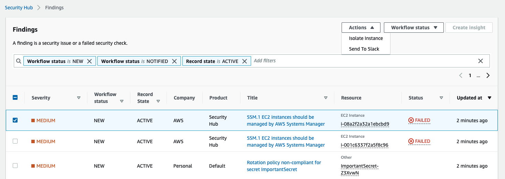

    !!! info "Your custom actions drop down list will have more options than displayed here."

4.	In **Slack**, navigate to your channel to see the finding that was sent from Security Hub. 

    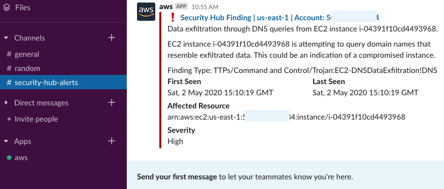

## Enable Custom Action to add Tag data as Notes to Security Hub Findings

In this section you will follow the same pattern of creating a Security Hub custom action and EventBridge rule to Lambda.  The custom Lambda function will look up the tags for an EC2 instance, and the resulting tag information will be added to the selected Security Hub finding as a note.

### Create Security Hub Custom Action

1.	Navigate to the **Security Hub dashboard**. 

2.	In the left-hand navigation pane choose **Settings**. 

3.	Choose the **Custom actions** tab. 

4.	Click the **Create custom action** button. 

5.	Enter an Action **Name** (Displayed in the Security Hub Console), **Action Description**, and an **Action ID** of "getTags".

    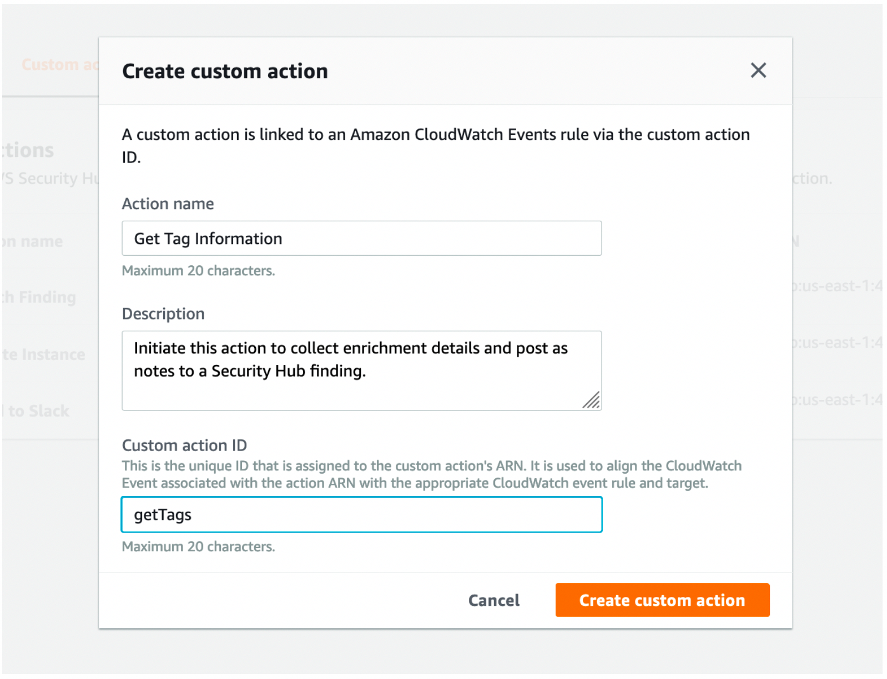

6. Click **Create custom action**. 

7. Copy the Custom action ARN that was generated for your custom finding.

!!! info  "You will need the custom action ARN in the next steps. "

### Create a EventBridge Rule to capture Security Hub Custom action

1. Navigate to the **Amazon EventBridge** Console.

2. Click on the **Create rule** on the right side.

3. In the Create rule page give your rule a **name** and a **description** that represents the rule's purpose.

4. Under Define pattern, select **Event pattern**. 

5. Select **Pre-defined pattern by service**.

6. In the drop down for **Service Provider**, select **AWS**.

7. In the drop down for **Service Name**, select or type and select **Security Hub**. 

8. In the drop down for **Event type** choose **Security Hub Finding – Custom Action**.

9.	In the **Event Pattern** window click the **Edit** button. 

10.	Add in the resources line as shown below, making sure to copy in the ARN of **your Custom Event**.  Click **Save**. 

    !!! info "Note the comma after the bracket before the resources definition."

    Copy and paste in the custom event pattern below.  Use the ARN you recorded for your Security Hub Custom Action 
      
    <pre>
    ```
    { 
    "source": [ 
        "aws.securityhub" 
      ], 
      "detail-type": [ 
        "Security Hub Findings - Custom Action" 
      ], 
      "resources": [ 
         "arn:aws:securityhub:us-east-1:[YOUR-ACCOUNT-ID]:action/custom/getTags" 
      ] 
    } 
    ```
    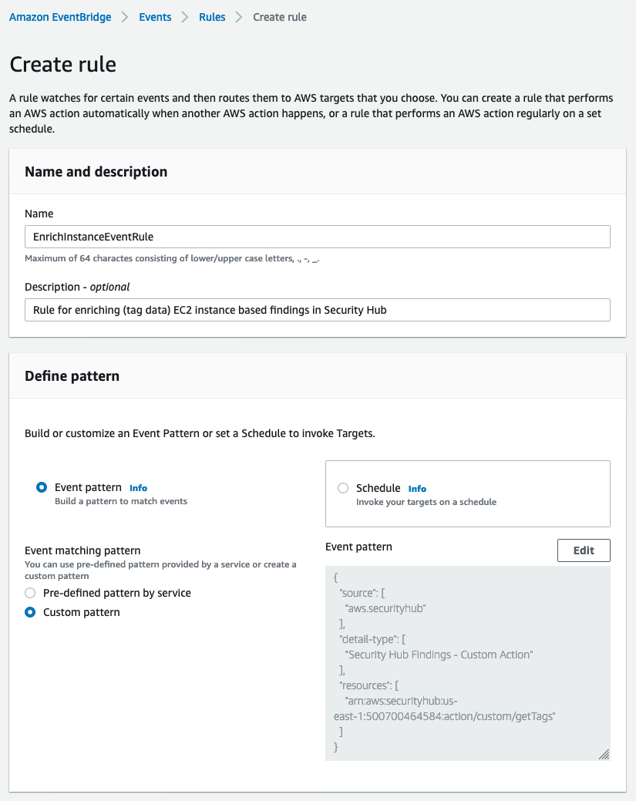

11. Under Select targets, ensure **Lambda function** is populated in the top drop down and then select **enrich-sec-hub-finding** lambda function. 

12. Click **Create**.

### Test your enrichment rule

1.	Navigate to the **Security Hub Dashboard**.

2.	In the left-hand navigation pane choose **Findings**. 

3.	Click in the search space to **Add filters**, and find **Resource Type**.

4.	Add **AwsEc2Instance** (case sensitive) after EQUALS and click **Apply**.

    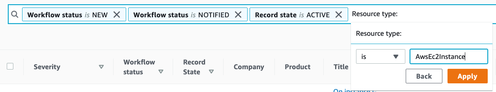

5.	**Click the Title** of the first finding in the list and observe that there are currently no **notes** in this finding.

    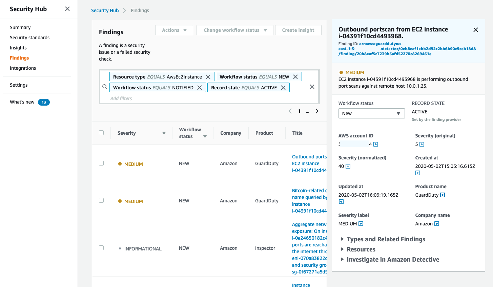

6.	Click the **check box** to the left of this same finding.

7.	Click the **Actions down arrow** and select your new custom action (Get Tag Information) to add tags to the notes of this finding.

8.	**Refresh** your browser.

9.	**Click the Title** of the first finding again, and this time view the Notes.

    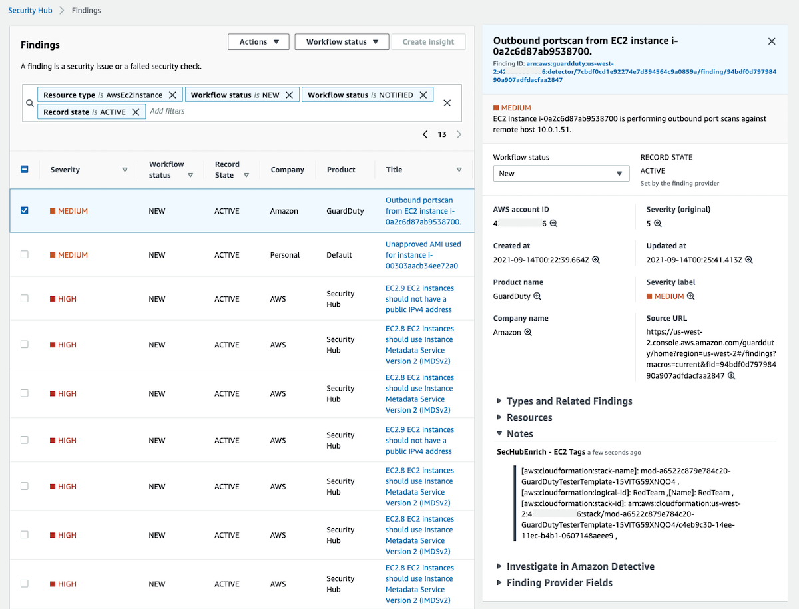

!!! question "What other data would you add to findings ad-hoc or automatically?"

!!! question "How would you edit the EventBridge rule to have the enrich function run every time a new finding is created, instead of manually initiated?"

In this module you explored two possible methods to improve operational response time to Security Hub findings by receiving a finding in Slack and by adding customized context to a finding.  
